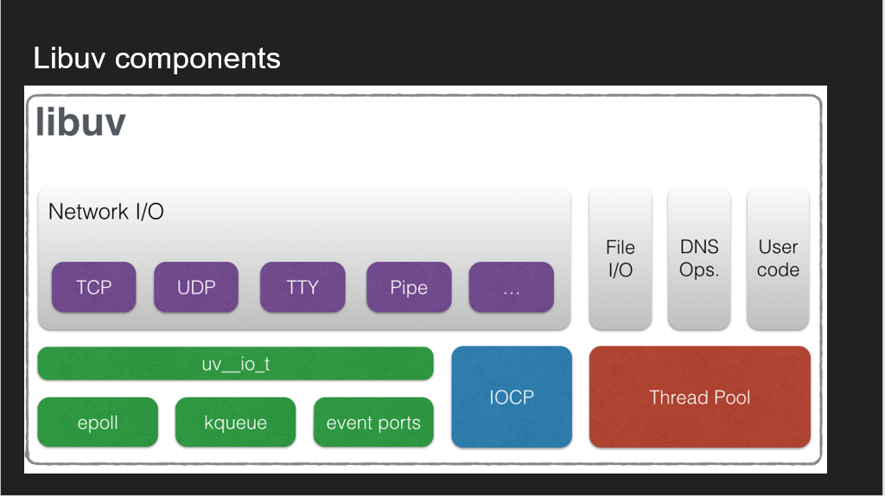

# Node_Architecture

Deep Dive into how Nodejs work

## NodeJS Architecture

I cover the various phases in the event loop and what exactly happens in each phase, how promises are just callbacks, how and when modules are loaded and their effect on performance, Node packages anatomy and more

## Node Internals

This is where we go one layer deeper, how Node truly achieves asynchronous IO with libuv, and how each protocol in node is implemented. How concurrent node works on both user level threads and process level.

## Node Optimization and Performance

Now that we understand the internals and architecture of Node, this is where we discuss tips how to make the code runs more efficiently and more performance. And only when we exhaust all other avenues Node provides ways to extend it with C++ add-ons where JavaScript just can't no longer hold.

## LibUV

- [Document](https://docs.libuv.org/en/v1.x/design.html)

# Libvu Component



```vbnet
JavaScript → Node C++ binding → libuv I/O request
           ↓                  ↘
     callback stored     libuv assigns an internal "req" object with ID
                             ↓
        Event loop runs → I/O finishes (e.g., file read, TCP done)
                             ↓
       Callback is put into the correct event loop phase (e.g., poll)
                             ↓
               JavaScript callback is invoked

```

## Thread Pool

[how it work internal](./thread_pool.md)

## Socket event

[socket event](./socket_event.md)

## V8

- [Document](https://v8.dev/blog/fast-async)

# Event-Loop


## Include nextTick and microTask: <br>

```arduino
 ┌────────────────────────────┐
 │  Phase 1: Timers           │ <── setTimeout, setInterval callbacks
 └────────────┬───────────────┘
              ▼
    🔥 process.nextTick queue (FIFO, includes nested)
    ✅ microtask queue (Promise.then, includes nested)
    ⬇️ Continue to next phase

 ┌────────────────────────────┐
 │  Phase 2: Pending Callbacks│ <── I/O deferred callbacks
 └────────────┬───────────────┘
              ▼
    🔥 process.nextTick queue (FIFO, includes nested)
    ✅ microtask queue (Promise.then, includes nested)
    ⬇️ Continue to next phase

 ┌────────────────────────────┐
 │  Phase 3: Poll             │ <── New I/O events, read/write
 └────────────┬───────────────┘
              ▼
    🔥 process.nextTick queue (FIFO, includes nested)
    ✅ microtask queue (Promise.then, includes nested)
    ⬇️ Continue to next phase
 ┌────────────────────────────┐
 │  Phase 4: Check            │ <── setImmediate()
 └────────────┬───────────────┘
              ▼
    🔥 process.nextTick queue (FIFO, includes nested)
    ✅ microtask queue (Promise.then, includes nested)
    ⬇️ Continue to next phase

 ┌────────────────────────────┐
 │  Phase 5: Close Callbacks  │ <── close events
 └────────────┬───────────────┘
              ▼
    🔥 process.nextTick queue (FIFO, includes nested)
    ✅ microtask queue (Promise.then, includes nested)
    ⬇️ Continue to next phase

 ┌────────────────────────────┐
 │  Back to Phase 1 (loop)    │
 └────────────────────────────┘


```

- ✅ Both **process.nextTick()** and **Promise.then() queues are drained completely before moving to the next phase — including new items added during their own execution**.

# 🧵 Task Queues Overview

## 🟦 MacroTasks

Also called "Tasks", they include: <br>

- **setTimeout**
- **setInterval**
- **setImmediate**
- **I/O callbacks (like from fs.readFile)**
- **MessageChannel or postMessage**

These are **scheduled to run in different event loop phases**. <br>

## 🟩 MicroTasks

Also called "Jobs", they include: <br>

- **Promise.then(), catch(), finally()**
- **queueMicrotask()**
- **process.nextTick()** (sort of — special case, more on that later)

These **run after the current operation finishes, before the event loop continues to the next phase**. <br>

## 🧪 process.nextTick()

- It's a Node.js-specific **special microtask**.
- It schedules a callback to **run immediately after the current operation completes, before any other microtasks like Promises**.
- This gives it **higher priority than normal microtasks**.

# Callback Internally

[how callback work](./callback.md)

# Promise Internally

[how promise work internally](./promise.md)

# Async/Await

[how async/await work internally](./await.md)
