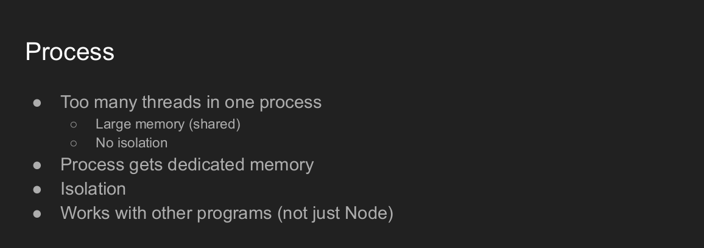
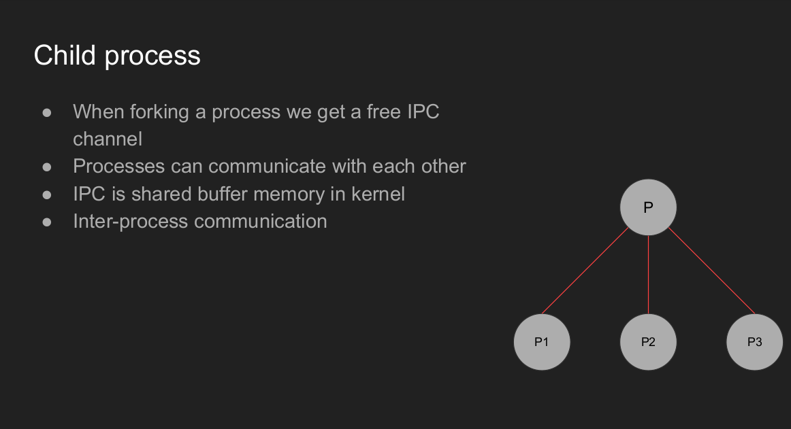
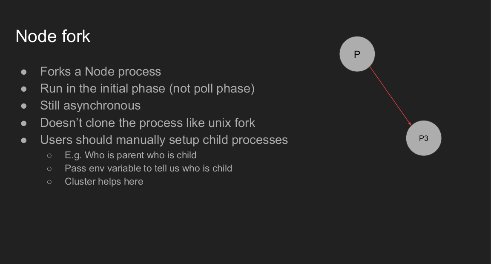
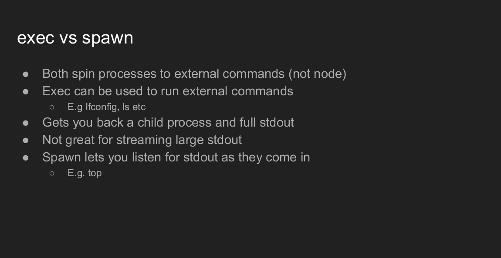
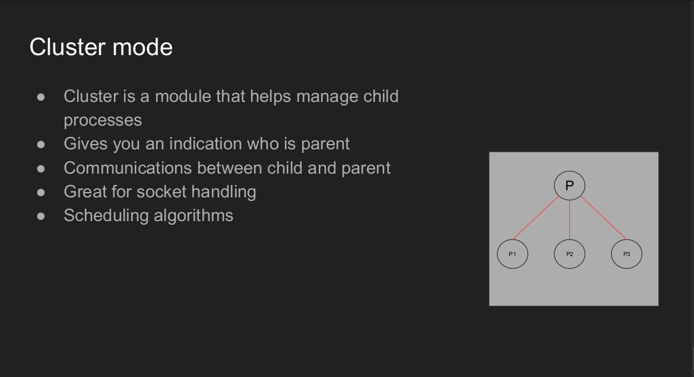
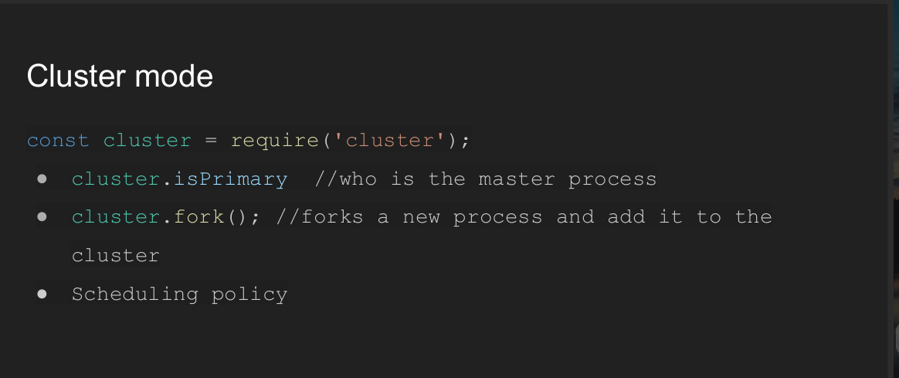
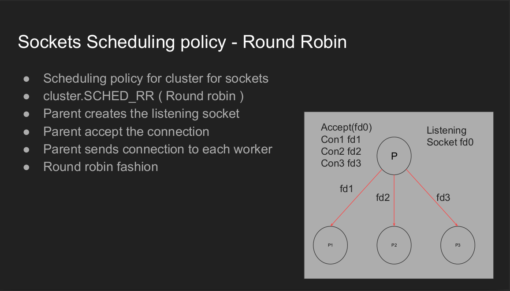
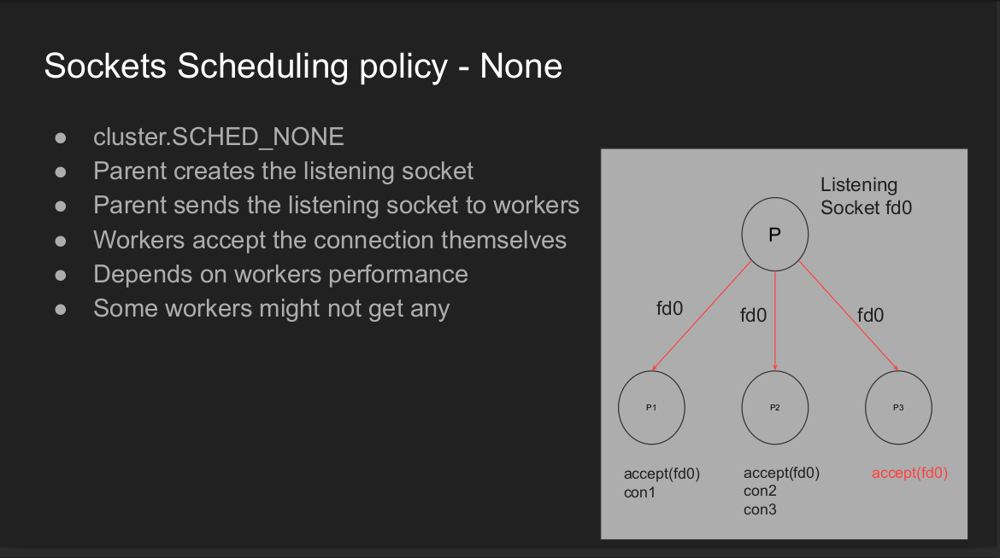
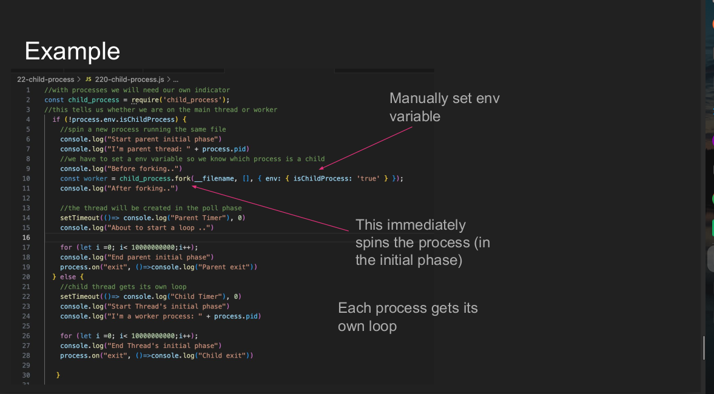
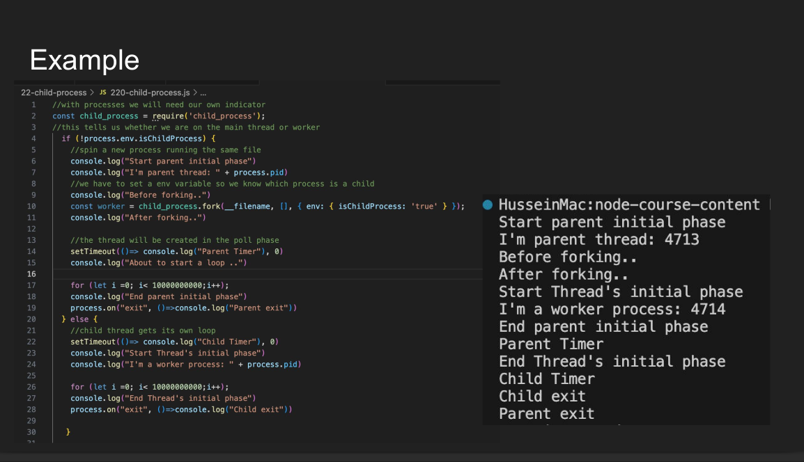

# What is Child Process

## How process communicate - Inter Process Communicate(iPC)

## Node Fork

## Exec vs Spawn

# Cluster

## Socket Scheduling Policy

### Round-robin

### Node

# Example

