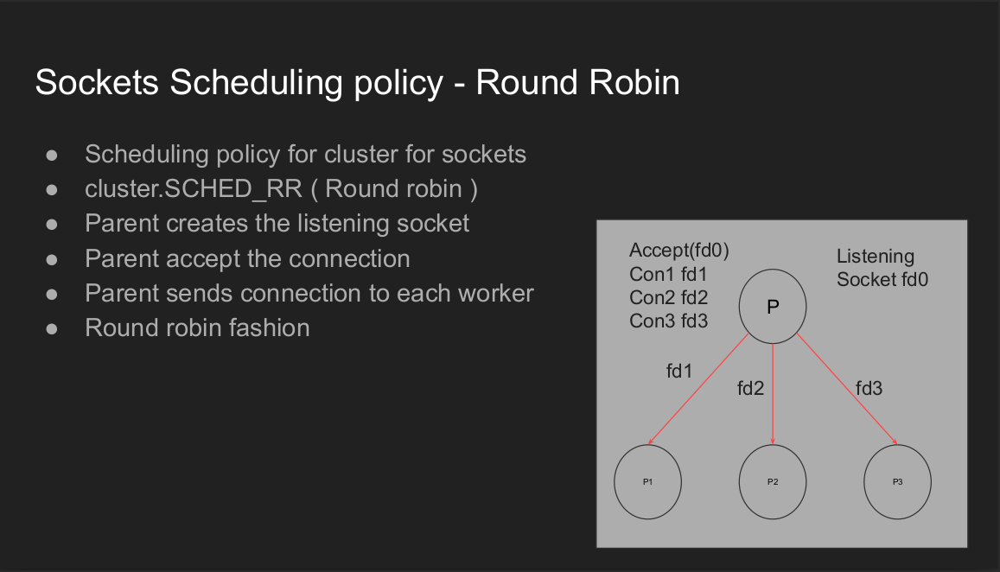
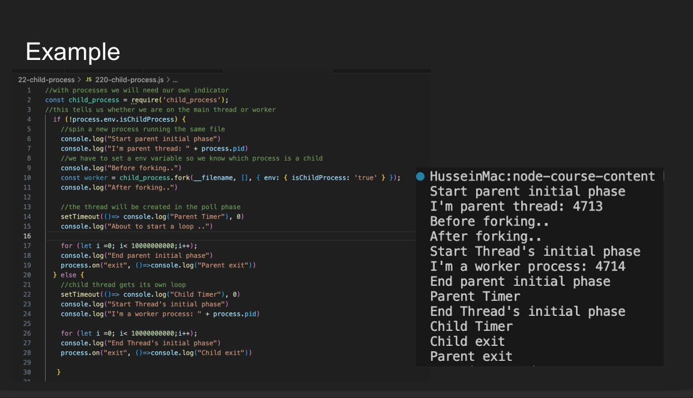

# Cluster


## Socket Scheduling Policy

### Round-robin



### Node


# Example




# Deep dive
## Cluster
 
The cluster module in Node.js is essentially a built-in **load balancer + process manager**. <br>

It allows you to: <br>
- Spawn multiple worker processes that all share the same server port.
- Utilize multiple CPU cores efficiently.
- Keep fault isolation — if one worker crashes, the master can restart it.

```js
import cluster from 'node:cluster';
import os from 'node:os';
import http from 'node:http';

if (cluster.isPrimary) {
  const numCPUs = os.cpus().length;
  for (let i = 0; i < numCPUs; i++) cluster.fork();

  cluster.on('exit', (worker) => console.log(`Worker ${worker.process.pid} died`));
} else {
  http.createServer((req, res) => res.end(`Handled by ${process.pid}`)).listen(3000);
}
```

## Architecture Overview
```
             ┌──────────────────────┐
             │      Master (PID 1)  │
             │  - spawns workers    │
             │  - load balances req │
             └──────────┬───────────┘
                        │ IPC (pipe)
        ┌───────────────┼────────────────┐
        │               │                │
┌─────────────┐  ┌─────────────┐  ┌─────────────┐
│ Worker #1   │  │ Worker #2   │  │ Worker #3   │
│ (PID 101)   │  │ (PID 102)   │  │ (PID 103)   │
└─────────────┘  └─────────────┘  └─────────────┘
```

Each worker: <br>
- Is a full child process (created via child_process.fork()).
- Has its own V8 engine, event loop, heap, and memory.
- Communicates with the master through IPC channels.

## Internal Creation Process
When you call cluster.fork(): <br>

Master uses child_process.fork() <br>
- Under the hood, Node calls the fork() syscall:
  ```
  pid_t pid = fork();
  ```

- The kernel duplicates the parent process:
  - Copies page tables (copy-on-write)
  - Duplicates file descriptors
  - Creates a new PID

The new process starts from the same code, but Node sets process.env.NODE_UNIQUE_ID to mark it as a worker. <br>

#### Worker starts with modified execArgv
The child re-runs the same Node script, but internally: <br>
```
process.env.NODE_UNIQUE_ID = workerId;
cluster.isPrimary = false;
cluster.isWorker = true;
```
So your code re-enters but runs the worker branch of your if statement. <br>

## Inter-Process Communication (IPC)
Master and workers communicate through pipes (UNIX domain sockets) created before forking. <br>

#### Internal Flow:

When fork() is called, Node creates: <br>
- A pair of connected pipes (socketpair()).
- One end stays in the master, the other goes to the worker

Messages are serialized using structured clone (same mechanism as postMessage). <br>

Each worker’s process object has: <br>
```
process.send({ hello: 'world' });
process.on('message', msg => console.log(msg));
```
These map to internal C++ bindings using sendmsg() and recvmsg() syscalls.
```
User JS → process.send() → libuv pipe write → kernel socket buffer → worker’s pipe → libuv read → worker.on('message')
```

## Shared Server Handle Mechanism (Key Optimization
Now the magic: <br>

How can multiple workers listen on the same port (e.g. 3000) without “EADDRINUSE”?

#### The Trick:
- Only the master process actually calls listen(3000).
- The server socket (file descriptor) is created once in the master.
- The master then shares this FD with each worker over IPC using sendmsg().

#### Kernel-Level Mechanics:
- When you pass a file descriptor through a Unix domain socket, the kernel:
  - Creates a duplicate file descriptor in the recipient’s FD table (same underlying socket in the kernel).
  - So each worker process has its own FD pointing to the same socket object.
 
```[Master]
  socket(3000)
     │
     ├── sendmsg() FD → Worker#1
     ├── sendmsg() FD → Worker#2
     └── sendmsg() FD → Worker#3
```

Each worker then calls server.listen({ fd: sharedFd }). <br>

