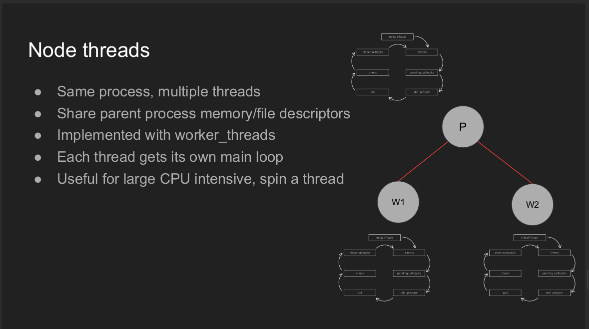
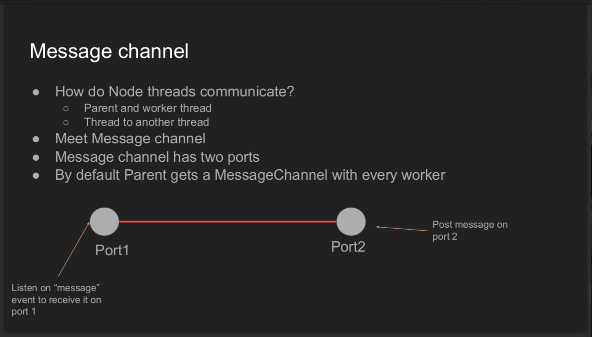
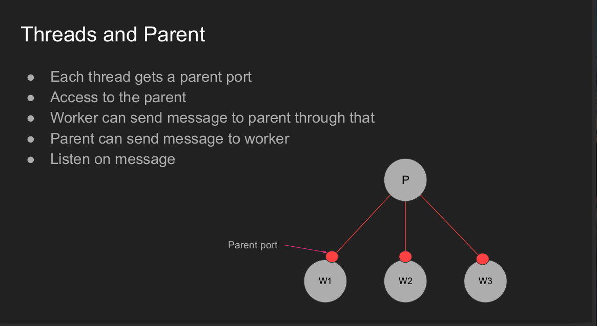
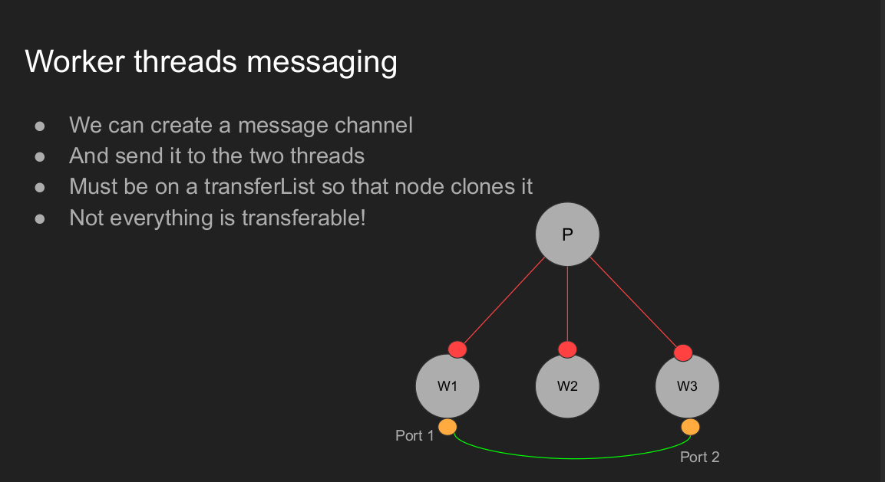
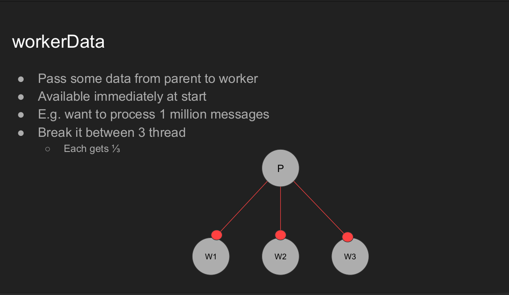
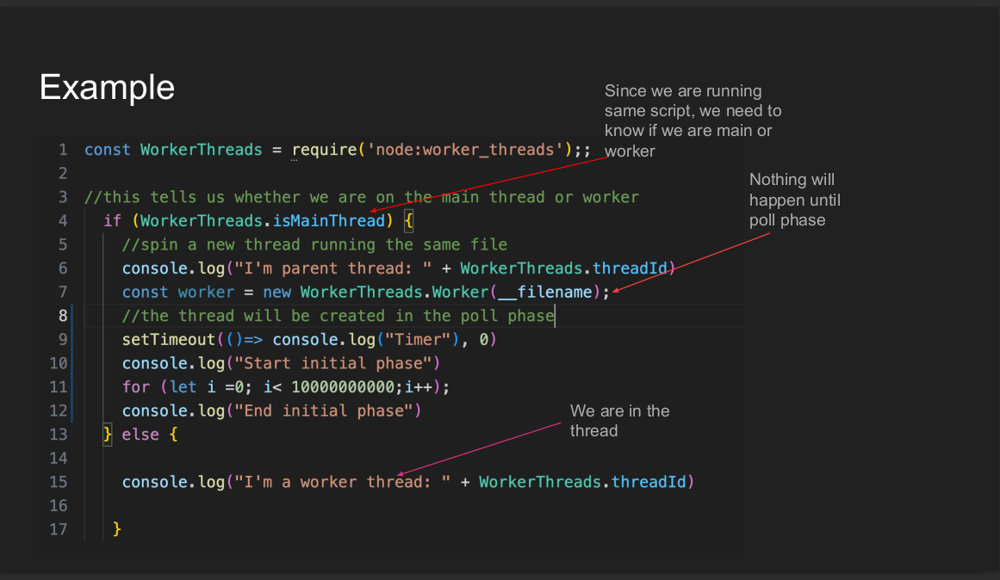
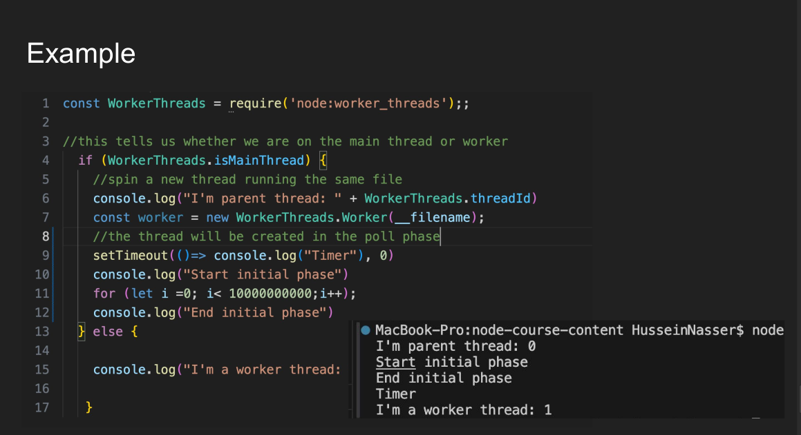
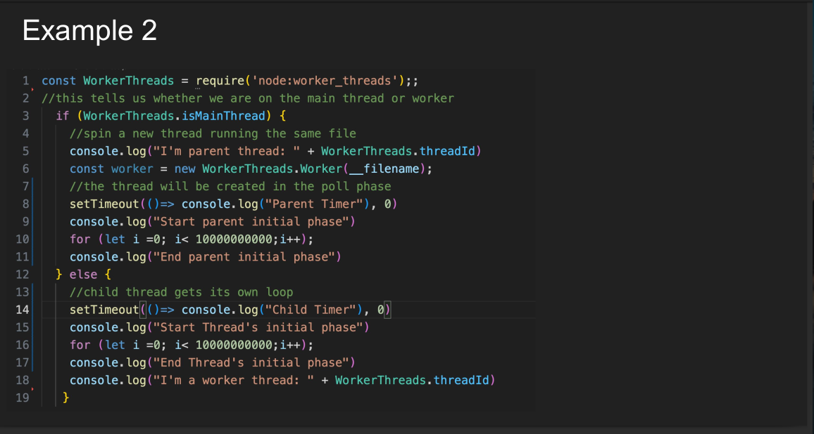
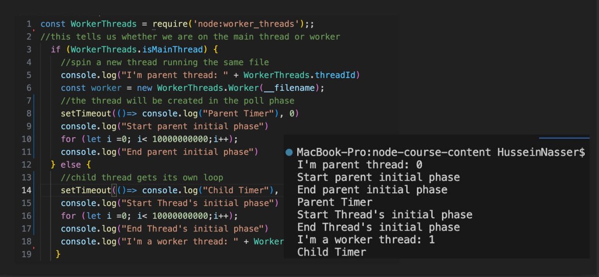

## What is Worker Thread



## Message Channel



## Thread and Parent communicate



## Thread vs Thread communicate



## WorkData



## How many thread


# Example 1





# Example 2





# Deep dive
## Layer 1 — libuv Thread Management & Event Loops
When Node.js creates a worker thread: <br>
```js
const { Worker } = require('worker_threads');
new Worker('./task.js');
```

it triggers a chain of C++ internals: <br>

#### node:worker_threads → src/node_worker.cc
- Main thread JS call → C++ binding in node_worker.cc.
- Worker::New() is called → allocates a new Worker object.
- Calls uv_thread_create() to start a new OS thread.
- Inside that thread, it calls:
  ```
  Worker::Run() {
  isolate = NewIsolate();
  context = NewContext(isolate);
  uv_loop_init(&loop);
  StartEventLoop(&loop);
  }
  ```

- a new V8 isolate
- a new libuv event loop (uv_loop_t)
- a new microtask queue
- its own JS execution stack

#### Separate Event Loop per Thread
Each worker’s event loop is independent: <br>
```
Main Thread: uv_run(loop_main)
Worker A:    uv_run(loop_A)
Worker B:    uv_run(loop_B)
```

#### Both threads (main and worker) share:
- The heap memory pages (same address space)
- The file descriptors
- The global variables (unless isolated by V8)

#### But each thread has:
- Its own stack
- Its own V8 isolate (separate JS runtime environment)
- Its own libuv event loop

#### This creates a new thread in the same process, The OS thread scheduler can assign that thread to a different CPU core. then we can run it in parralel

## Message Passing Implementation (libuv level)
Worker communication uses MessagePort, which internally uses: <br>

- uv_async_t → async notifications between loops in the same process.
- Each message send (postMessage()) triggers:
  ```
  uv_async_send(&worker_async);
  ```

The target loop wakes up, processes the message queue. <br>
So communication is in-memory, not via pipes — no kernel IPC, no context switch overhead (unlike fork()). <br>


## Shared Memory, Page Tables, and Copy-on-Write
### SharedArrayBuffer → Backed by Shared Virtual Memory
When you create: <br>
```js
const sab = new SharedArrayBuffer(1024);
```

Under the hood: <br>

- V8 allocates a backing store via ArrayBuffer::Allocator.
- That backing store maps shared pages using mmap() with flags like
  ```
  mmap(NULL, size, PROT_READ | PROT_WRITE, MAP_SHARED | MAP_ANONYMOUS, -1, 0);
  ```

- The MAP_SHARED flag means the same memory pages can be mapped into multiple threads’ address space.

So when the main thread passes this sab to a worker: <br>
```
worker.postMessage(sab);
```

- The worker’s isolate maps the same virtual memory pages.
- Both see the same memory region → zero-copy true shared memory.

## No Copy-on-Write
- Unlike fork() (which clones the page table using Copy-on-Write),
- SharedArrayBuffer maps the same page directly.
- So changes by one thread are instantly visible to the other — no kernel copy, no signal, no reallocation.

## Memory Synchronization via Atomics
Because CPU cores have L1/L2 caches <br>
a thread writing to shared memory might not be visible to another thread immediately. <br>

That’s why we use Atomics — which insert memory fences (barriers). <br>
```
Atomics.store(arr, 0, 1);
Atomics.load(arr, 0);
Atomics.wait(arr, 1, 0);
```

```js
const { Worker } = require('worker_threads');

const sab = new SharedArrayBuffer(4);
const view = new Int32Array(sab);

const worker = new Worker(`
  const { parentPort } = require('worker_threads');
  parentPort.on('message', (sab) => {
    const view = new Int32Array(sab);
    Atomics.store(view, 0, 123);
    Atomics.notify(view, 0);
  });
`, { eval: true });

worker.postMessage(sab);
Atomics.wait(view, 0, 0);
console.log(view[0]); // 123
```

| Step                      | What Happens                                              |
| ------------------------- | --------------------------------------------------------- |
| `new SharedArrayBuffer()` | Allocates shared physical pages (`mmap(..., MAP_SHARED)`) |
| `postMessage(sab)`        | Sends reference (not copy) to worker                      |
| Worker receives SAB       | Maps same physical pages into its address space           |
| `Atomics.store()`         | Writes to shared page                                     |
| `Atomics.notify()`        | Calls futex wakeup in kernel                              |
| `Atomics.wait()`          | Blocks thread until woken by futex                        |


So Atomics.wait/notify are the only times kernel syscalls happen for shared memory synchronization. <br>

#### Worker Threads IPC
```
┌────────────┐      ┌───────────────────────┐      ┌────────────┐
│  Thread 1  │ ───▶ │  Shared Message Queue │ ◀─── │  Thread 2  │
│  (Main)    │      │  + uv_async wakeup    │      │  (Worker)  │
└────────────┘      └───────────────────────┘      └────────────┘
```
- 🔹 Data lives entirely in user-space memory.
- 🔹 Only minimal kernel wakeup (1 eventfd or pipe byte).

#### Child Process IPC
```
┌────────────┐    write()     ┌────────────┐    read()     ┌────────────┐
│  Parent    │ ─────────────▶ │  Kernel FD │ ─────────────▶ │   Child    │
│  Process   │                │  (pipe buf)│                │  Process   │
└────────────┘                └────────────┘                └────────────┘
```
- 🔸Full kernel involvement: copy → context switch → wakeup → copy back.


#### Why Worker Threads Are Faster
```
| Property              | Worker Thread | Child Process        |
| --------------------- | ------------- | -------------------- |
| Copy count            | 1 (in-memory) | 2 (user→kernel→user) |
| Wakeup cost           | 1 syscall     | 2–3 syscalls         |
| Context switches      | 1–2           | 3–4                  |
| Memory model          | Shared        | Isolated             |
| Communication latency | ~5–10 µs      | ~0.5–2 ms            |
```

#### What Happens in Hardware

When you call Atomics.store():

- It emits a machine instruction like LOCK XCHG (on x86).
- This instruction flushes the CPU’s store buffer → ensures global visibility.
- The memory barrier ensures all previous writes are visible to other cores before continuing.

Atomics.wait() is implemented with a futex-like mechanism in Linux: <br>
- futex(addr, FUTEX_WAIT, expected_value, timeout)
- The kernel parks the thread until another thread calls Atomics.notify() → triggers FUTEX_WAKE.
- So Atomics.wait/notify → user-level blocking/signal via kernel futex system calls.

## Kernel and Scheduler Behavior

### OS View of Node.js with Worker Threads
#### 1 main + 3 workers
| PID  | Thread | Description                          |
| ---- | ------ | ------------------------------------ |
| 1234 | T1     | Main thread (event loop + V8)        |
| 1234 | T2     | Worker #1 (own V8 isolate + uv loop) |
| 1234 | T3     | Worker #2                            |
| 1234 | T4     | Worker #3                            |

All share:

- Same address space (same heap mappings)
- Same open files / sockets (FD table)
- Same PID (getpid() → same for all)
- Each has its own kernel thread control block (TCB)

### Kernel Scheduling
The Linux kernel scheduler:

- Treats each thread as a schedulable entity (same as process).
- Each has its own registers, stack pointer, and program counter.
- The scheduler picks which thread to run next using CFS (Completely Fair Scheduler).

**Threads may run on different CPU cores — parallel execution of JS code in different isolates.**


## Comparison with Child Process Internals
| Concept                | Worker Thread            | Child Process             |
| ---------------------- | ------------------------ | ------------------------- |
| **Address Space**      | Shared                   | Separate (new page table) |
| **Creation Mechanism** | `uv_thread_create`       | `fork()` + `exec()`       |
| **Memory Sharing**     | Optional (SAB)           | None (COW on fork)        |
| **IPC**                | In-memory (`uv_async_t`) | Kernel pipes / sockets    |
| **Synchronization**    | Atomics / futex          | Kernel buffers            |
| **Context Switch**     | Thread-level (light)     | Process-level (heavy)     |
| **Crash Containment**  | Shared process (all die) | Isolated                  |
| **Startup Time**       | < 5 ms                   | ~100 ms                   |


## Summary
```
┌───────────────────────────────────────────┐
│ Node.js Process (PID 1234)                │
│                                           │
│  ┌────────────┐     ┌────────────┐        │
│  │ Thread #1  │     │ Thread #2  │ ...    │
│  │ (Main Loop)│     │ (Worker)   │        │
│  ├────────────┤     ├────────────┤        │
│  │ V8 Isolate │     │ V8 Isolate │        │
│  │ JS Heap    │     │ JS Heap    │        │
│  └────────────┘     └────────────┘        │
│       ↑ Shared Memory (SAB) ↕             │
│     Atomics + futex for sync              │
└───────────────────────────────────────────┘
```
