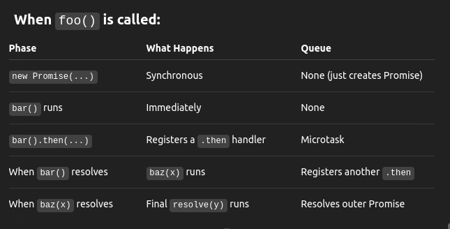

# 🔹 What is async/await?

- ✅ It's syntactic sugar over Promises.

```js
async function foo() {
  const result = await someAsyncFunction();
  return result + " done";
}
```

same as: <br>

```js
function foo() {
  return someAsyncFunction().then((result) => result + " done");
}
```

### Key Points:

- async makes a function always return a Promise.
- await pauses the function until the awaited Promise resolves (or rejects).
- But it doesn’t block the thread — it yields control to the event loop (via microtasks).

## 🔬 How Does async/await Work Internally?

### Step 1: async function always returns a Promise

```js
async function greet() {
  return "hi";
}

greet().then(console.log); // logs "hi"
```

Internally: <br>

```js
function greet() {
  return Promise.resolve("hi");
}
```

### Step 2: await pauses the function

```js
async function fetchData() {
  const data = await getUser();
  console.log(data);
}
```

It transforms into something like this: <br>

```js
function fetchData() {
  return getUser().then((data) => {
    console.log(data);
  });
}
```

But behind the scenes, it's managed like a generator function (a coroutine), using: <br>

- **State machine**
- **Promise chaining**
- **Microtask scheduling**

# 🔁 Step-by-step Breakdown of await

```js
async function demo() {
  console.log("1");
  const x = await Promise.resolve("2");
  console.log(x);
  console.log("3");
}
demo();
console.log("4");
```

#### Execution Order:

```js
1;
4;
2;
3;
```

### Internal Flow:

- 1.demo() starts running.
- 2.Logs "1".
- 3.Hits await Promise.resolve("2") → this:

  - suspends the function.
  - returns a Promise (P1) that will resume demo once resolved.

- 4.JS continues → logs "4".

- 5.After current call stack, Promise P1 resolves → demo resumes inside a **microtask**:

  - Logs "2"
  - Logs "3"

# ⚙️ Internals in V8 (Engine-Level)

- Internally, async functions are transformed into generator-like state machines.

```js
async function foo() {
  const x = await bar();
  const y = await baz(x);
  return y;
}
```

Internally becomes something like: <br>

```js
function foo() {
  // 🟢 1. Called synchronously — returns a Promise immediately
  return new Promise((resolve, reject) => {
    try {
      // 🔵 2. bar() is called synchronously
      // bar() returns a Promise (P1)
      bar().then((x) => {
        // 🟡 3. This function is scheduled as a microtask once P1 resolves
        baz(x).then((y) => {
          // 🟠 4. This is another microtask once P2 resolves
          resolve(y); // finally resolves the outer Promise
        }, reject);
      }, reject);
    } catch (e) {
      // 🔴 If bar() throws synchronously (not via Promise), reject immediately
      reject(e);
    }
  });
}
```

- the code inside the new Promise(...) constructor runs immediately, up to the first .then() call. That includes the call to bar().
- .then(...) callbacks don't run immediately — they’re scheduled as microtasks to run after the current synchronous code and call stack finish.

- The final resolve(y) will only happen after all the chained .then()s complete, and those are microtasks triggered step-by-step.

Or in C++ terms (V8): <br>

- Compiles to an AsyncFunctionGenerator object.
- Awaited calls become awaitInstructions.
- When await is hit, V8 suspends the generator and stores its resume context.
- A microtask is queued to resume execution after the Promise settles.

## 🧱 Internal Queueing Breakdown



# 🎯 What Happens When You await?

```js
await somePromise;
```

## Internally:

- 1.Evaluates somePromise
- 2.Queues a microtask:

  - When resolved → resumes the function at the await point

- 3.Wraps the whole thing in a Promise returned by the async function

Think of await as saying: <br>

- "Pause here. When this Promise resolves, resume the function right here, in a microtask."

# 🧵 Event Loop & Microtask Timing Recap

```js
async function test() {
  console.log("A");
  await Promise.resolve();
  console.log("B");
}

test();
console.log("C");
```

Output: <br>

```js
A;
C;
B;
```

Why: ? <br>

```js
Why?

await suspends after "A"

"C" runs (sync)

After call stack clears, microtask runs to resume async fn → logs "B"
```
