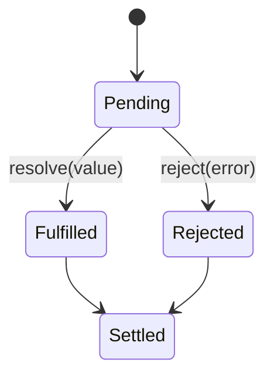

# What is Promise

- A Promise in JavaScript is an object that represents the eventual completion (or failure) of an asynchronous operation and its resulting value

## The Lifecycle of a Promise:

- Pending: The initial state, where the asynchronous operation is still running.
- Resolved (Fulfilled): The state when the asynchronous operation completes successfully.
- Rejected: The state when the asynchronous operation fails.

```js
const promise = new Promise((resolve, reject) => {
  // Asynchronous operation
  if (operationSuccess) {
    resolve("Success!"); // Settles the promise to the resolved state
  } else {
    reject("Failure!"); // Settles the promise to the rejected state
  }
});
```

## Microtasks and the Event Loop:

- When a Promise is resolved or rejected, **it doesn’t immediately execute the then() or catch() methods**. Instead, it **schedules the execution of those handlers in the microtask queue (a queue for small tasks that should be executed after the currently executing script, but before rendering and other tasks)**.

# Internal Promises in Node.js — State, Result, and Handlers

Understanding how internal Promises work in **Node.js**, especially when using something like `fs.promises.readFile()`, requires digging into V8 internals, libuv, and the event loop.

---

## ✅ TL;DR Summary

| Step | What happens |
|------|--------------|
| 1.  | `fs.promises.readFile()` uses Node.js internals to call libuv via native bindings. |
| 2.  | When the async file read completes (in libuv), a C++ callback is invoked. |
| 3.  | That callback eventually **resolves the Promise** (via V8 API), storing the result. |
| 4.  | The `.then()` handler is scheduled in the **microtask queue** and runs in JS land. |
| 5.  | All of this is backed by V8 internals (C++), using heap-allocated structures to store state, result, and handlers. |

---

## 🔍 Step-by-Step: `fs.promises.readFile()`

```js
import { readFile } from 'fs/promises';

readFile('example.txt', 'utf8')
  .then((data) => {
    console.log('File data:', data);
  })
  .catch((err) => {
    console.error('Error reading file:', err);
  });
```

---

## 🧱 1. Internal Structure of a Promise

Internally (abstractly), a Promise consists of:

### ✅ State  
> `pending` → `fulfilled` or `rejected`

### 📦 Result  
> The value (data or error) when resolved or rejected.

### 📋 Handlers  
> Functions registered via `.then()`, `.catch()`, `.finally()`  
> These are stored while the promise is **pending**, and executed once it **settles**.

---

## 🧪 Example Breakdown: `readFile`

```js
const promise = readFile('example.txt', 'utf8');
```

### At creation:

| Property      | Value            |
|---------------|------------------|
| `state`       | `pending`        |
| `result`      | `undefined`      |
| `handlers`    | `[]` (empty array) |

---

### When `.then()` is called:

```js
promise.then((data) => {
  console.log(data);
});
```

| Property      | Value              |
|---------------|--------------------|
| `state`       | `pending`          |
| `result`      | `undefined`        |
| `handlers`    | `[onFulfilled]`    |

---

### When file is read successfully:

| Property      | Value              |
|---------------|--------------------|
| `state`       | `fulfilled`        |
| `result`      | `'file contents'`  |
| `handlers`    | `[onFulfilled]`    |

- The promise transitions from `pending → fulfilled`
- Its result is stored
- The handlers are moved to the microtask queue to be executed

---

### Microtask Queue Execution:

```js
onFulfilled('file contents'); // → console.log(data)
```

| Property      | Value              |
|---------------|--------------------|
| `state`       | `fulfilled`        |
| `result`      | `'file contents'`  |
| `handlers`    | `[]` (emptied)     |

---

## ❌ If the file doesn’t exist

```js
readFile('missing.txt', 'utf8')
  .then(...)
  .catch((err) => { console.error(err); });
```

| Property      | Value              |
|---------------|--------------------|
| `state`       | `rejected`         |
| `result`      | `Error: ENOENT`    |
| `handlers`    | `[onRejected]`     |

---

## 🔁 Internal State Transition Flow



---

## 🧠 Where Is It All Stored?

| Part              | Stored in…                 | Notes |
|-------------------|----------------------------|-------|
| `[[PromiseState]]`| V8 heap (C++)              | Initially `pending` |
| `[[PromiseResult]]`| V8 heap                    | Value or error after resolution |
| `[[PromiseFulfillReactions]]` | V8 reaction records | `.then()` callbacks |
| JS handlers       | Heap references to JS closures | Stored in internal fields |

---

## 🔧 Native Execution Path (fs.promises.readFile)

1. JS calls `readFile('file.txt')`
2. Internally wraps `fs.readFile()` via Promise
3. C++ layer uses `FSReqPromise` to track the promise
4. Calls `uv_fs_read()` from libuv (C)
5. I/O work done (kernel thread or worker pool)
6. libuv calls back into Node native layer
7. Native layer calls `resolve()`
8. V8 sets:
   - `[[PromiseState]] = fulfilled`
   - `[[PromiseResult]] = data`
9. V8 pushes `.then()` handler to microtask queue
10. JS handler runs after current event loop turn

---

## 🧪 Bonus: Simulating a Promise Internally

```js
function myPromiseExecutor() {
  let state = 'pending';
  let result;
  let handlers = [];

  const resolve = (value) => {
    if (state !== 'pending') return;
    state = 'fulfilled';
    result = value;
    handlers.forEach(h => queueMicrotask(() => h.onFulfilled(result)));
  };

  const reject = (error) => {
    if (state !== 'pending') return;
    state = 'rejected';
    result = error;
    handlers.forEach(h => queueMicrotask(() => h.onRejected(result)));
  };

  const then = (onFulfilled, onRejected) => {
    handlers.push({ onFulfilled, onRejected });
  };

  // Simulate async operation
  setTimeout(() => resolve('hello!'), 10);

  return { then };
}

const p = myPromiseExecutor();
p.then(
  (val) => console.log('Got:', val),
  (err) => console.error('Error:', err)
);
```

---

## 📎 Visualization of Queue Priority

| Queue/Callback Type     | When It Runs                  | Priority |
|-------------------------|-------------------------------|----------|
| `process.nextTick()`    | Before microtasks             | 🔥 Very High |
| **Promise.then()**      | Microtask queue               | ✅ High |
| `setTimeout()`          | Timer phase (next loop)       | ⏲️ Medium |
| `setImmediate()`        | Check phase                   | ⏱️ Medium |
| I/O callbacks           | Poll phase                    | ⚙️ Normal |
| Sync code               | Immediately                   | 🧠 Top |

## Promise Resolution and Chaining:

- When a Promise is resolved, it triggers the .then() method on it, and when rejected, it triggers .catch(). These methods return new Promises, which allows chaining:

```js
promise
  .then((value) => {
    console.log(value); // "Success!"
    return "Next step"; // Returns a new Promise (or value)
  })
  .then((nextValue) => {
    console.log(nextValue); // "Next step"
  })
  .catch((error) => {
    console.error(error); // Handles errors from any previous promise
  });
```

- Create a new Promise and attach the provided handlers (callbacks) to it.
- The handlers are invoked when the original Promise is settled.
- If the handler returns a value (non-Promise), it’s automatically wrapped in a resolved Promise.
- If the handler throws an error, the returned Promise is rejected.

```js
Promise.resolve(1)
  .then((val) => {
    console.log("Step 1:", val);
    return val + 1;
  })
  .then((val) => {
    console.log("Step 2:", val);
    return new Promise((resolve) => setTimeout(() => resolve(val + 1), 100));
  })
  .then((val) => {
    console.log("Step 3:", val);
  });
```

### 🔍 What happens under the hood?

#### Step 1: Promise.resolve(1)

- Creates a resolved Promise with value 1.

#### 🔸 Step 2: .then(callback)

When you call .then() on a Promise: <br>

- A new Promise is created and returned.
- The callback you pass is registered to run when the original Promise is fulfilled.
- That callback is scheduled into the microtask queue. <br>

```js
const p2 = p1.then(fn);
```

Is functionally: <br>

```js
const p2 = new Promise((resolve, reject) => {
  // When p1 settles...
  p1.onFulfilled = (val) => {
    try {
      const result = fn(val); // run your .then callback
      resolve(result); // resolve p2 with the return value
    } catch (err) {
      reject(err); // reject p2 if error happens
    }
  };
});
```

- So each .then() returns a new Promise linked to the previous one.

#### 💡 Important Internals:

- If fn() returns a value → the next Promise is resolved with that value.
- If fn() returns a Promise → the next Promise "follows" it — it waits for that inner Promise to resolve.
- If fn() throws an error → the next Promise is rejected.

### 🔄 Visual Model of the Chain:

```js
Promise.resolve(1)
  .then((val) => {
    // creates promise P1
    return val + 1; // resolves P2
  })
  .then((val) => {
    // creates promise P2
    return new Promise((res) => setTimeout(() => res(val + 1), 100)); // async op
  })
  .then((val) => {
    // creates promise P3
    console.log(val); // outputs 3
  });
```

⏳ Behind the scenes: <br>

- Each .then() returns a new Promise.
- Each new Promise has its own microtask.
- If a .then() returns a Promise, it waits for that inner Promise to resolve.

### ⚠️ Common Mistake — Not Returning in Chain

```js
Promise.resolve(1)
  .then((val) => {
    console.log("step 1");
    new Promise((resolve) => setTimeout(() => resolve(val + 1), 100));
  })
  .then((val) => {
    console.log("step 2", val); // val is undefined!
  });
```

Why? Because we didn’t return the inner Promise, so the chain doesn’t wait! <br>
✅ Fix: <br>

```js
.then((val) => {
  return new Promise((resolve) => setTimeout(() => resolve(val + 1), 100));
})

```

## 📦 1. Does Each Promise Have Its Own Queue?

- Yes, internally each Promise object maintains its own reaction queue.

```js
const p = Promise.resolve(42);
p.then((x) => console.log("A", x));
p.then((x) => console.log("B", x));
```

- This creates two reactions on p. So p internally maintains a list like:

```js
[[PromiseFulfillReactions]]: [
  reactionJobFor("A"),
  reactionJobFor("B")
]

```

## 🧾 How .then() Works Internally

```js
const p = new Promise((resolve) => resolve(1));
p.then((val) => console.log("1", val));
```

Here's the internal logic of .then(): <br>

```js
function then(onFulfilled) {
  const reactionRecord = {
    type: "fulfill",
    handler: onFulfilled,
    capability: newPromiseCapability()
  };

  if (this.[[PromiseState]] === "pending") {
    this.[[PromiseFulfillReactions]].push(reactionRecord);
  } else if (this.[[PromiseState]] === "fulfilled") {
    queueMicrotask(() => {
      try {
        const result = reactionRecord.handler(this.[[PromiseResult]]);
        reactionRecord.capability.resolve(result);
      } catch (e) {
        reactionRecord.capability.reject(e);
      }
    });
  }

  return reactionRecord.capability.promise;
}

```

- This means .then() doesn’t immediately execute. It creates a new promise reaction record and either queues it (pending) or runs it in a microtask (already resolved).

## 🔁 How Promise Chaining Works

```js
Promise.resolve("a")
  .then((x) => x + "b")
  .then((x) => x + "c")
  .then(console.log);
```

### Internal Flow:

Each **.then()** call: <br>

- Creates a new promise (let’s say p2, p3, …).
- Registers a handler to the previous promise’s queue.
- When the previous promise resolves:
  - Its .then() handler runs in a microtask.
  - The return value of the handler resolves the next promise.

### Chaining

```js
Promise (value: "a")
   └─── then (x => x + "b") → Promise (value: "ab")
          └─── then (x => x + "c") → Promise (value: "abc")
                 └─── then (console.log)

```

- Each .then() adds a reaction that feeds into the next promise in the chain.

## How Microqueue is Used in the Chain

```js
Promise.resolve("a")
  .then((x) => {
    console.log("Step 1", x);
    return x + "b";
  })
  .then((x) => {
    console.log("Step 2", x);
    return x + "c";
  });
```

### Execution

- 1.JS starts: resolves initial promise → queues then callback to microtask queue.
- 2. Event loop:
  - Finishes current script.
  - Runs microtask queue in order:
    - Step 1 runs → returns "ab"
    - Step 2 gets scheduled with "ab" → runs → returns "abc"

So, the entire chain is broken down into a sequence of microtasks. <br>

## Behind the Curtain – Microtask Execution Lifecycle

```js
const p1 = Promise.resolve("foo");

const p2 = p1.then((val) => {
  console.log("A", val);
  return val + "bar";
});

p2.then((val) => {
  console.log("B", val);
});
```


- Promises are JS objects with internal PromiseReaction queues.
- A queue flush triggers a PromiseReactionJob.
- These jobs are stored in V8’s Isolate-level microtask queue (one per thread).
- When V8 finishes executing JS stack, it runs all queued microtasks before processing the next event.

# ✅ Summary Table


