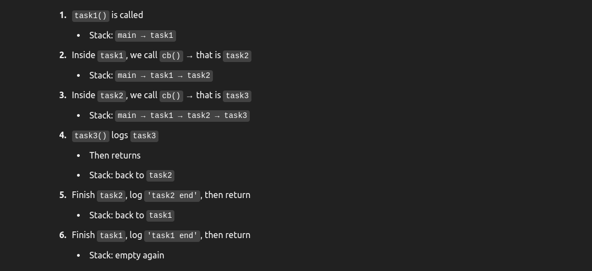
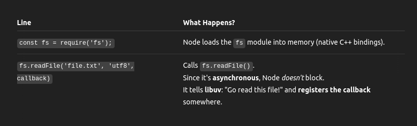
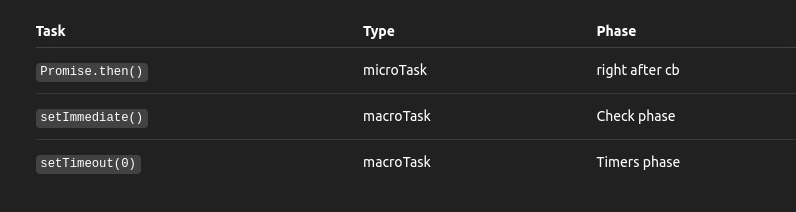

# 🧠 What is a Callback?

# Callback with normal function

```js
function task1(cb) {
  console.log("task1 start");
  cb();
  console.log("task1 end");
}

function task2(cb) {
  console.log("task2 start");
  cb();
  console.log("task2 end");
}

function task3() {
  console.log("task3");
}

task1(() => {
  task2(() => {
    task3();
  });
});
```

- This is all **synchronous code**, meaning it **does not involve the event loop, libuv, or async queues at all**.
- Instead, it's purely **managed by the JavaScript call stack**.

## 🔁 Execution Trace (Step by Step)

```scss
main()               ← global script execution
└── task1()
    └── task2()
        └── task3()

```

Output: <br>

```js
 task1 start
task2 start
task3
task2 end
task1 end

```

## 🔍 Explanation (Line-by-Line)



# Callback with LibUv

- A callback is just a function passed as an argument to another function, to be called later (often after an asynchronous operation completes).

```js
const fs = require("fs");

fs.readFile("file.txt", "utf8", (err, data) => {
  if (err) throw err;
  console.log(data);
});
```

## 🔬 Step-by-Step Breakdown (with Event Loop Phases)

### 1️⃣ Initial Script Execution (Call Stack)

- **Phase**: Script phase (before event loop even starts)
- **Call Stack**: Directly executes line by line.



➡️ The callback is not executed or queued immediately. <br>
➡️ It's registered and stored internally until libuv finishes reading the file. <br>
➡️ Once that happens, the callback is pushed into the I/O callback queue, which is processed during the Poll phase of the event loop. <br>

### Step 2: Your Code Runs

```js
fs.readFile("file.txt", "utf8", callback);
```

- JS calls a C++ binding (fs.readFile is actually implemented in Node’s C++ core).
- Node internally calls uv_fs_read() from libuv.

### 🔹 Step 3: Callback Registration

- Your callback is stored in internal metadata alongside the I/O request:

```js
internalCallbackMap[requestId] = yourCallback;
```

#### ✅ Important: It is not pushed into the event loop queue yet.

### 🔹 Step 4: libuv Performs File I/O

Now libuv does the actual heavy lifting: <br>

- If the platform supports async file I/O → handled directly.
- Otherwise, it's passed to libuv’s thread pool (worker thread reads the file).

This is completely happening outside the event loop now (non-blocking magic ✨). <br>

### 🔹 Step 4: I/O Completes

After some time... <br>

- File is read.
- libuv gets a result (either success or error).
- Now it wants to call your JS callback.

But libuv can't call JS directly — it needs to queue the callback to run back on the JS main thread. <br>

- 👉 Pushes the callback onto the I/O callback queue.
- This queue is processed in the Poll phase of the event loop.

### 📝 What About MacroTask vs MicroTask?

- **MacroTask**: The callback from fs.readFile is a macroTask. It goes into the I/O callback queue (processed in the Poll phase).

- **MicroTask**: If you had a Promise.then() inside that callback, it would run immediately after the callback finishes, before the event loop continues.

```js
fs.readFile("file.txt", "utf8", () => {
  console.log("file done");
  Promise.resolve().then(() => console.log("microtask inside callback"));
});
```

Output: <br>

```js
file done
microtask inside callback  <-- runs before next I/O macroTask

```

## What if i do with readFileSync

```js
const fs = require("fs");

const data = fs.readFileSync("file.txt", "utf8");
console.log(data);

console.log("Done");
```

🔎 What happens now? <br>

- fs.readFileSync() is blocking.
- The JavaScript thread stops and waits for the file to finish reading.
- No event loop, no libuv thread pool, no callback queue.
- Execution only continues after the file is completely read.

Output: <br>

```nginx
Hello
Done

```

# Nested Callback - not use Promise

```js
const fs = require("fs");

fs.readFile("file1.txt", "utf8", (err, data1) => {
  if (err) throw err;
  console.log("file1 read:", data1);

  fs.readFile("file2.txt", "utf8", (err, data2) => {
    if (err) throw err;
    console.log("file2 read:", data2);

    fs.readFile("file3.txt", "utf8", (err, data3) => {
      if (err) throw err;
      console.log("file3 read:", data3);
    });
  });
});
```

## 1️⃣ Script Execution (Initial Phase)

```js
fs.readFile("file1.txt", "utf8", callback1);
```

- JS reaches this line, hands it off to libuv
- The callback1 is registered and stored with the request in libuv, queue internal
- JS continues — but there's nothing else — so the call stack empties
- The event loop starts

## 2️⃣ Event Loop Phase 1: file1.txt completes

When file1.txt is done: <br>

- libuv queues callback1 into the Poll phase
- Event loop executes it:

```js
console.log("file1 read:", data1);

fs.readFile("file2.txt", "utf8", callback2);
```

- Again, the fs.readFile('file2.txt') hands the task to libuv
- Callback2 is now registered
- JS is done again → call stack empties → wait for next event

## 3️⃣ Event Loop Phase 2: file2.txt completes

When file2.txt is read: <br>

- libuv queues callback2
- Event loop runs it:

```js
console.log("file2 read:", data2);

fs.readFile("file3.txt", "utf8", callback3);
```

- Hands off to libuv
- Waits for file3…

## 4️⃣ Event Loop Phase 3: file3.txt completes

Same thing: <br>

- callback3 is pushed into the I/O callback queue
- Event loop runs it:

# Add setTimeout or setImmediate

```js
fs.readFile("file.txt", () => {
  console.log("fs done");

  setTimeout(() => console.log("timeout"), 0);
  setImmediate(() => console.log("immediate"));
  Promise.resolve().then(() => console.log("microtask"));
});
```

Output order is likely: <br>

```
fs done
microtask
immediate
timeout

```


