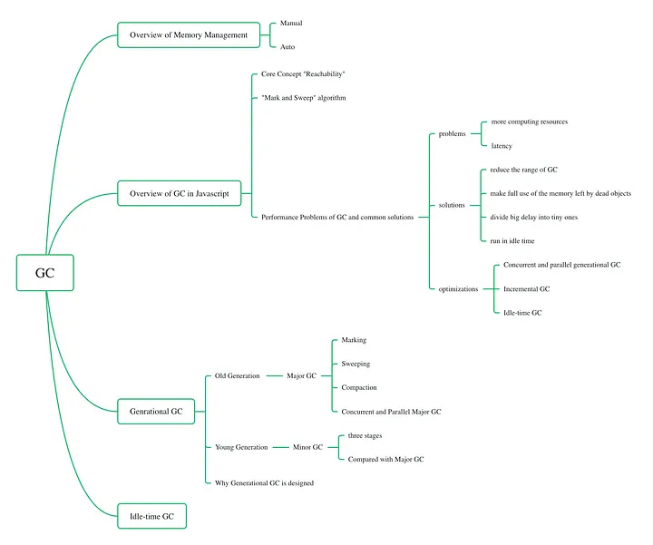

# Garbage collector

After reading a series of JavaScript books and V8 official blogs on memory management in JavaScript, I wrote them down and added them to precise works. <br>

Here’s the general outline for this article: <br>


## Overview of Memory Management

- Typically, there are two ways of memory management: automatic or manual.
  Automatic memory management: GC is a form of automatic memory management. When the memory is no longer referenced, it will be reclaimed by the garbage collector, e.g., JavaScript, Go, Java, Python
- Manual memory management: programmers have to manage the memory manually, e.g., C/C++
  

### Advantages Of GC

Compared to the manual way, GC saves us time by freeing us from manually deallocating memory. Moreover, it could help us avoid these memory-management errors:

### Dangling pointers

This happens when the memory is freed but is still referenced by some pointers. <br>
A typical C++ example looks like this: <br>

```
#include<stdio.h>

int *call();
int main() {

  int *ptr;
  ptr = call();

  fflush(stdin);
  printf("%d", *ptr);
  return 0;
}

int * call() {
  int x=25;
  ++x;

  return &x;
}
```


The pointer ptr is a dangling pointer, as it points to the local variable x. After the function is called, the variable x becomes dead. But the pointer is still pointing to that location. <br>

## Double-free or corruption error

This error occurs when the program tries to free the memory twice or free the entity that has not been allocated. <br>

For example, in the following C++ code, pointer i has been freed twice: <br>

```
#include<iostream>

using namespace std;

int main()

{
   int * i = new int();
   delete i;
   //i = NULL;
   delete i;
}
```

And you would get an error like this: <br>

```
ERROR: AddressSanitizer: attempting double-free on 0x602000000010 in thread T0:
```

To avoid this error, programmers have to do some extra jobs: <br>

- Set pointer to NULL after free
- Check for NULL before freeing.
- Initialise pointer to NULL at the start.

## Memory leak

A memory leak occurs when we forget to free unreachable memory. And as these pieces of memory pile up, it could lead to memory exhaustion. <br>

Here is a memory leak code snippet in C++: <br>

```
#include <bits/stdc++.h>
using namespace std;

void func_mem_leak()
{
 int* ptr = new int(5);

 // return without deallocating ptr
 return;
}

int main()
{
 func_mem_leak();

 return 0;
}
```

To avoid this, we have to delete pointers for new pointers when they are unreachable manually. <br>

In this example, before the func_mem_leak function returns, we have to call the delete function to deallocate this pointer. <br>

```
void func_mem_leak()
{
    int* ptr = new int(5);

    // delete pointer ptr
    delete (ptr);
}
```

## Disadvantages of GC

Although garbage collection has the advantages listed before, it has the following big disadvantages that would harm performance: <br>

- First, it consumes extra computing resources to track and decide which could be freed up.
- Second, GC would result in unpredictable stalls. Unlike manual memory management, memory deallocation works implicitly, and it is out of the programmers’ control. Especially in real-time environments, such as transaction processing or interactive programs, “stop-the-world” GC or scattered stalls are unacceptable. Although we have come up with incremental and concurrent GC solutions, performance harm can only be minimized but not eliminated.Second, GC would result in unpredictable stalls. Unlike manual memory management, memory deallocation works implicitly, and it is out of the programmers’ control. Especially in real-time environments, such as transaction processing or interactive programs, “stop-the-world” GC or scattered stalls are unacceptable. Although we have come up with incremental and concurrent GC solutions, performance harm can only be minimized but not eliminated. <br>

## The Main Concept “Reachability”

Garbage collectors monitor all objects and remove those that have become unreachable, so we need to understand which objects can be marked as reachable and which are not. <br>

What are reachable values? <br>

Simply put, “reachable” values are those that are accessible. There are two types of reachable values. <br>

The first type is called “roots,” and it includes the following: <br>

- Global variables
- Currently executing a function, its local variables, and parameters

The second type is objects on the chain of roots’ references. For example, if a global object A has a property referencing B, then B is marked as reachable too. <br>

## Example: Interlinked Family

Take this interlinked object as an example. In the graph below, the global variable, family, has two references, mother and father, and they are referenced by each other. <br>

The family is taken as roots. And father and mother are taken as roots' references. <br>

```
function marry(man, woman) {
  woman.husband = man;
  man.wife = woman;

  return {
    father: man,
    mother: woman
  }
}

let family = marry({
  name: "John"
}, {
  name: "Ann"
});
```


If you were given the task: make the father object unreachable, what would you do? <br>

The following code would not work as expected because father is referenced by two objects: family and mother. <br>

- `delete family.father;`

To make father unreachable, we have to delete both references: <br>

```
delete family.father;
delete family.mother.husband;
```


Although father references mother, it’s not referenced by roots. Father doesn't have incoming references. <br>

Now that we have a basic understanding of “reachability,” let’s dive deeper into the algorithm behind GC! <br>

## “Mark and Sweep” Algorithm

- “Mark and Sweep” algorithm: JavaScript, Go.
- “Reference Counting” algorithm: Objective-C

### JavaScript uses the “Mark and Sweep” algorithm as its GC algorithm like this:

1.Mark: mark the roots as “reachable” <br>
2.Visit and recursively mark objects directly or indirectly referenced by roots as “reachable” <br>
3.Sweep: unmarked ones are removed <br>


## Performance Problems of GC and Common Solutions

Just like what we mentioned before, GC mainly has two performance problems: <br>

- Needs more computing resources
- Might introduce “stop the world” delays

Solutions for these two problems are around these basic ideas: <br>

- Reduce the range of objects that need to track
- Make full use of the memory left by dead objects
- Divide big delays into tiny ones
- Run GC while the CPU is idle

V8 has created the following optimizations to make GC efficient and reduce the time of “stop the world”: <br>

- Concurrent and parallel generational GC
- Incremental GC — Walking and marking the whole object set simultaneously takes time and introduces visible delays. Why not split the whole object into multiple parts? Although it might take some extra work as the unmarked objects might become marked in later parts, it shortens the delay.
- Idle-time GC — run GC while the CPU is idle.

## Concurrent and Parallel Generational GC

### Old generation and young generation

The heap in V8 is split into different regions called generations. Just like the image shown below, it’s split into two:

- Young generation: including “Nursery” and “Intermediate” sub-generations
- Old generation
  

- Initially, objects are in the Nursery region.
- If they survive the first round of GC, they will be moved to the Intermediate region
- If they survive the second round of GC, they will be moved to the Old Generation region.


For each generation, the algorithm is different: <br>

- Young generation — Minor GC (Scavenger)
- Old generation — Major GC (Full Mark-Compact)

Let’s move on to have a look at these two algorithms. <br>

## Major Garbage Collector — Full Mark Compact

Major GC happens in three phases: marking, sweeping, and compacting. <br>


### Marking

The marking process involves identifying reachable objects. <br>

As we’ve described, it starts as a set of known objects’ pointers called the root set. This includes the execution stack and the global object. Then it recursively marks the roots’ direct and indirect references as “reachable.” <br>

### Sweeping

In this phase, not only would GC free unreachable objects, but it would add contiguous gaps left by dead objects to the Free List.

### “Free List” data structure

Suppose we do the “free” job. After freeing, the memory region could be fragmented. The size of vacant memory might vary from each other: small, medium, and big sizes. When we want to allocate memory the next time, we must iterate the heap and find the appropriate size. This takes a lot of time. <br>

To accelerate the looking-up process, a “free list” data structure is designed. <br>

After identifying the unreachable objects, GC would move them to the “free list.” The next time we want to allocate memory, we look at the free list and quickly get the desired chunk of memory. <br>

“Free list” solves the speed problem but can not turn the small size into the big size. What if we want a big size of memory but only get scattered small pieces of memory? How could we make use of scattered gaps left by dead objects? <br>

## Compaction

To reuse the small and scattered memory gaps left behind by dead objects, we would process the “compact” task: copy surviving objects into other pages and free the old page. <br>

This does have a high cost of copying when many long-living objects exist, so we only process compaction on highly-fragmented pages. <br>


## Concurrent and Parallel Major GC

Major GC is both concurrent and parallel: <br>

In the Marking stage, it works concurrently. When the main thread executes JavaScript, helper threads do GC work in the background. <br>

For the Sweeping/Compacting stage, it works parallelly. The main thread and helper threads do a roughly equal amount of work at the same time. The main thread would stop the execution of JavaScript from marking the finalization phase to the end of the compaction phase. <br>


## Minor Garbage Collector — Scavenger

Before we illustrate the Scavenger algorithm, we must clarify the following concepts: <br>

## “From-Space” and “To-Space”

For the young generation, the space is divided into two parts: Nursery and Intermediate. This is called the “Semi-space” design, meaning half of the total place is always empty. <br>

- “To-Space”: initially-empty area (Nursery)
- “From-Space”: the area we copy from (Intermediate)

These two concepts are relative and depend on the direction GC move from and to. <br>

## Old-to-new references

These refer to pointers in the old generation referring to objects in the young generation. Why do we need these old-to-new references? <br>

As mentioned before, the objects that survived GC twice would be moved to the old generation. But where should we move them to? To locate the appropriate size, we have to trace through the entire old generation. <br>

By using write barriers to maintain a list of old-to-new references, we could easily locate objects in the old generation without tracing the entire old generation. <br>

## Three stages

Mark: same as what we do in the old generation

## Evacuate

In the old generation, moving dead objects to Free List or moving surviving objects to new pages is expensive. <br>

Because we have divided the young generation into two parts, we only have to limit the moving behavior within the page. Instead of focusing on the dead objects, we only focus on the surviving ones. We move all surviving objects to a contiguous chunk of memory within the page, and thus the from-space has become the “whole garbage.” Free the “From-Space” all! <br>

After moving, To-Space becomes From-Space and vice-versa. And the From-Space becomes empty, and new allocations can be done in the From-Space. <br>


Space for the young generation is limited to 16MB, and it would quickly reach its limit. Objects that survive a second GC are evacuated into the old generation rather than To-Space. <br>


## Update the pointers

As the objects have been moved, the pointers must be updated to point to the new location. <br>

## Parallel Scavenging

Unlike marking in major GC, marking in minor GC works parallel to the other two tasks. <br>

The scavenging tasks use thread-local allocation buffers for fast synchronization-free allocation of surviving objects.The scavenging tasks use thread-local allocation buffers for fast synchronization-free allocation of surviving objects. <br>


## Compared with Major GC

As the table shows below, minor GC is designed for “incremental” changes. It takes parts of live objects and works frequently. Although it has “stop the world” pauses, they are shorter than major GC’s. <vr>


## Why Generational GC Was Designed

As mentioned, GC is divided into major and minor GC for different generations. But why should we do this generational division? <br>

The main reason is we want to shorten the latency by recycling and compacting the memory more efficiently. Before moving on, we have to illustrate three concepts. <br>

Concept 1: Any garbage collector has a few essential tasks. <br>

- Identify live/dead objects
- Recycle/reuse the memory left by dead objects
- Compact/defragment memory

Concept 2: generational hypothesis where most objects are allocated and then almost immediately become unreachable <br>

Concept 3: The cost of moving among pages is bigger than moving within pages. <br>

If we don’t design the young generation, we’ll have to reuse memory work, add all dead objects to Free List, compact memory, and move surviving objects to different pages. This takes a lot of time. <br>

As most objects would be dead immediately and the cost of moving among pages is bigger, we don’t have to pay much cost to the dead objects. We need to focus on the surviving objects and move them within pages. Just like what minor GC does in the young generation! <br>

Moving only the surviving objects makes every other allocation ‘implicit’ garbage. This means we only pay a little for the surviving objects, not the number of allocations. <br>

In short, the young generation is designed for “incremental” changes. In most cases, objects are dead immediately. We don’t have to make a great effort to deal with them. We need a more frequent and efficient way of dealing with them.If we don’t design the young generation, we’ll have to reuse memory work, add all dead objects to Free List, compact memory, and move surviving objects to different pages. This takes a lot of time. <br>

As most objects would be dead immediately and the cost of moving among pages is bigger, we don’t have to pay much cost to the dead objects. We need to focus on the surviving objects and move them within pages. Just like what minor GC does in the young generation! <br>

Moving only the surviving objects makes every other allocation ‘implicit’ garbage. This means we only pay a little for the surviving objects, not the number of allocations. <br>

In short, the young generation is designed for “incremental” changes. In most cases, objects are dead immediately. We don’t have to make a great effort to deal with them. We need a more frequent and efficient way of dealing with them. <br>

## Idle-Time GC

The window.requestAnimationFrame() method tells the browser that you wish to perform an animation and requests that the browser calls a specified function to update an animation before the next repaint. <br>

Similar to the requestAnimationFrame, The GC can post ‘Idle Tasks,’ and the browser can choose to run some idle tasks the GC has created in its spare time before the next frame. <br>


---

### Memory Management

- [DOC](https://www.memorymanagement.org/)
