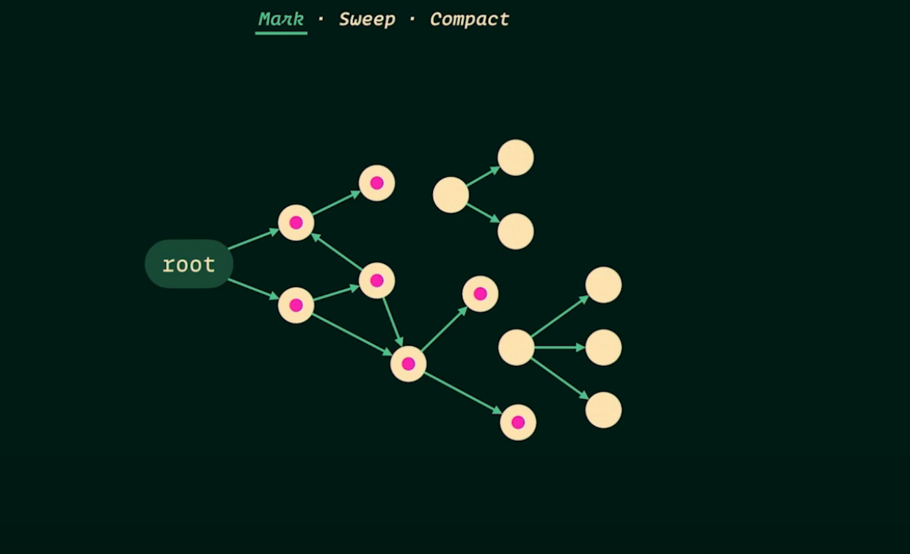
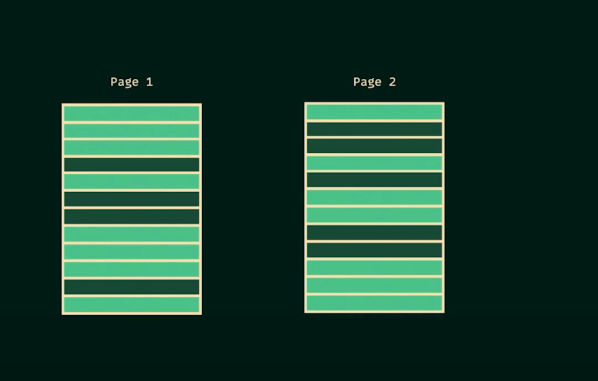
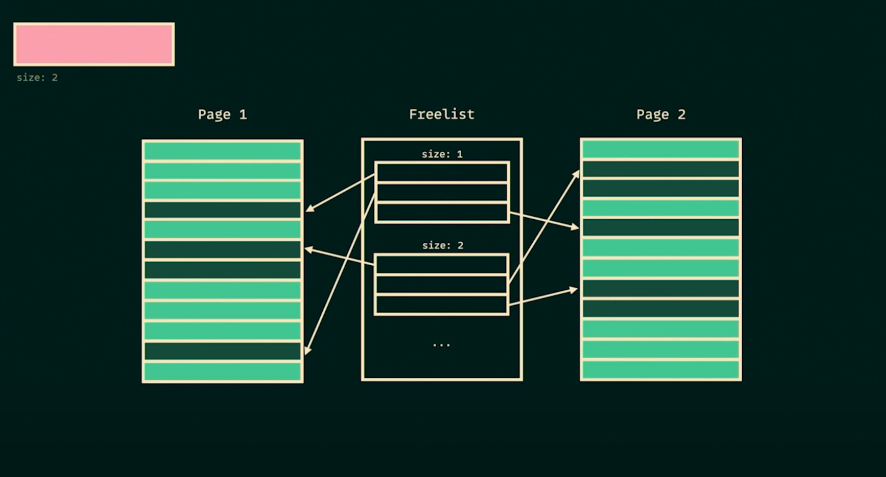
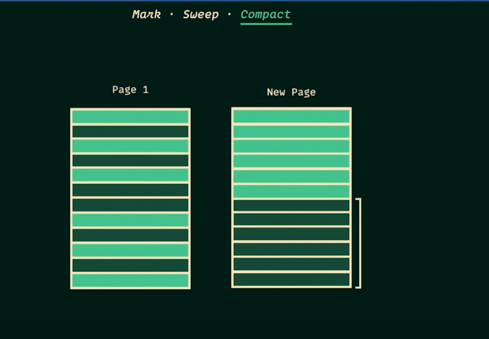
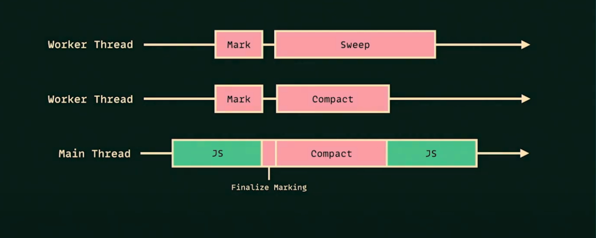

# ♻️ V8 Heap Memory: Young & Old Generation – Deep Dive with Diagrams

---

## 📦 What is the Heap in V8?

In V8 (used by Chrome and Node.js), the heap is split into two parts:

- **Young Generation** – for short-lived objects
- **Old Generation** – for long-lived objects

We have already deeply explored the **Young Generation**. Now let’s focus on the **Old Generation** in V8 and its full GC process.

---

# 🧓 Old Generation – Deep Dive

### 🔸 Purpose:

- Stores **long-lived**, **promoted** objects
- Much larger in size (can be hundreds of MB to GB)
- Collected less frequently but with more complex algorithms

### 🔸 GC Algorithm: Mark → Sweep → Compact

This multi-phase process cleans up unreachable memory without frequent copying.

---

# 📌 Step 1: Mark Phase



### 🎯 Goal:

Identify **live (reachable)** objects.

### 🔍 How it works:

1. Starts from **root set**: global variables, stack frames, closures
2. Traverses the object graph
3. Marks every reachable object with a **mark-bit** in its memory header

### 🧠 Visualization:

```
Roots:
 - global → obj1 → obj2
 - closure → obj3

Unreachable:
 - obj4, obj5 (no references)

[Before Marking]
+-----------+     +-----------+     +-----------+
| obj1      | --> | obj2      |     | obj4      |
+-----------+     +-----------+     +-----------+

[Mark bits]
obj1.mark = 1
obj2.mark = 1
obj4.mark = 0 ❌ (unreachable)
```

### 🧩 Where is the mark stored?

- V8 stores mark bits in **object headers** or metadata in each memory **page**
- Pages are chunks of memory (e.g., 1MB) grouped into a **space**
- Bitmaps are used for compact tracking of mark states

### ⚠️ Problems:

- Deep graphs require recursion (handled with mark stack)
- Large memory = long mark times
- All marking is done **Stop-the-World** (though V8 now uses **incremental/concurrent marking**)

# 🎨 Tri-Color Marking in V8

### 🔶 What is it?

A conceptual model used in incremental garbage collectors to track progress and correctness:

| Color | Meaning                                  |
| ----- | ---------------------------------------- |
| White | Unvisited, assumed dead                  |
| Gray  | Visited but children not fully explored  |
| Black | Visited and all children explored (live) |

### 📍 Purpose:

Tri-color marking is used in garbage collectors like V8 and HotSpot to determine which objects are alive and which can be collected. It's especially useful for incremental or concurrent GC.

### 🧠 How It Works – Step by Step

```js
let A = {
  name: "A",
  child: B,
};

let B = {
  name: "B",
  child: C,
};

let C = {
  name: "C",
  child: null,
};

let D = {
  name: "D",
  child: null,
};
```

Where:

- A → B → C
- D is isolated
- A is the root

#### Tri-color Algorithm Process

1. **Initialization:**

   - All objects start as **white**.
   - Root `A` is marked **gray**.

2. **Marking Phase:**

   - Pop gray `A`: mark black → scan `A.child = B` → mark `B` gray
   - Pop gray `B`: mark black → scan `B.child = C` → mark `C` gray
   - Pop gray `C`: mark black → no children → done

3. **Sweeping Phase:**

   - Remaining white `D` is unreachable → GC reclaims it

#### ✅ Final State

| Object | Color | Action    |
| ------ | ----- | --------- |
| A      | Black | Retained  |
| B      | Black | Retained  |
| C      | Black | Retained  |
| D      | White | Collected |

### ✅ Benefit:

- Allows **incremental and concurrent marking**
- Prevents premature collection (black → white violation)

---

# 🧱 Write Barriers – Ensuring Safety During Incremental Marking

### 📌 Purpose:

When GC is concurrent or incremental, your program (called the "mutator") modifies object references during marking. This can break the tri-color invariant:

> **"Black objects must not point to white objects."**

### 💡 What is a Write Barrier?

A write barrier is a small code snippet that runs during pointer assignments to notify GC about changes in object references.

### 👇 Example Without a Write Barrier:

```js
// During GC, mutator updates:
B.child = D;
```

Now:

- `B` is black
- `D` is white
- A black → white reference exists! GC may incorrectly collect `D`

### 🔧 Solution: Insert Write Barrier

```js
function safeAssign(parent, field, child) {
  parent[field] = child;
  if (isBlack(parent) && isWhite(child)) {
    markGray(child); // or re-mark parent
  }
}
```

This ensures `D` is eventually scanned and not collected.

### 🧠 V8-Specific Write Barrier:

```cpp
// V8's JIT pseudocode
StorePointer(B, 'ref', D) {
  if (IsBlack(B) && IsWhite(D)) {
    MarkGray(D);
  }
  B.ref = D;
}
```

### 🧩 Barrier Strategies:

- **Dijkstra-style (eager):** immediately mark the target gray
- **SATB (Snapshot-at-the-Beginning):** track old value before overwriting

### 📌 Visualization

Before mutation:

```
Heap:
[Page 0] A (gray) → B (white) → C (white)
[Page 1] D (white)
```

During mutation:

```
B.ref = D;
WriteBarrier(B, D);
Heap:
[Page 0] A (black) → B (black) → C (black)
[Page 1] D (gray)
```

Now `D` is added to the GC marking worklist and safely retained.

### 🔄 Summary

| Concept       | What It Solves               | Analogy                          |
| ------------- | ---------------------------- | -------------------------------- |
| Tri-color GC  | Detects live vs dead objects | Traffic light guiding GC         |
| Write Barrier | Safe mutation during GC      | Security checkpoint on mutations |

### 🔬 Bonus: V8 Optimizations

| Technique           | What it Does                         |
| ------------------- | ------------------------------------ |
| Incremental Marking | Reduces pause by splitting work      |
| Write Barriers      | Maintains GC safety while mutating   |
| Concurrent Marking  | GC runs parallel with JS code        |
| Remembered Sets     | Tracks pointers between generations  |
| Marking Deque       | Efficient worklist for marking phase |

---

# 🧹 Step 2: Sweep Phase

### 🎯 Goal:

Free memory for **unmarked** (dead) objects

### 🔧 How it works:



- Traverse each memory page
- For every unmarked object:
  - Add it to a **free list**
  - Do not touch marked objects



### 📦 Visualization:

```
Heap Page:
+-----------+-----------+-----------+-----------+
| obj1 ✅   | obj2 ❌   | obj3 ❌   | obj4 ✅   |
+-----------+-----------+-----------+-----------+

Sweep:
- obj2 and obj3 are dead → added to Free List

Free List:
[  Address of obj2  ]
[  Address of obj3  ]
```

### 💡 V8 Free List:

- A list of available memory chunks in each page
- New allocations reuse entries from the free list
- More efficient than shifting memory immediately

---

# 🧽 Step 3: Compact Phase (Optional)

### 🎯 Goal:

Reduce **fragmentation** in memory by **moving live objects** together

### 🚧 Why?

- After many sweeps, memory is **fragmented**
- Some pages have gaps, making large object allocation inefficient



### 🧠 Visualization:

```
[Before Compacting]
+-----------+-----+-----------+-----+-----------+
| obj1      |     | obj4      |     | obj7      |
+-----------+-----+-----------+-----+-----------+

[After Compacting]
+-----------+-----------+-----------+
| obj1      | obj4      | obj7      |
+-----------+-----------+-----------+
Remaining space: combined
```

### 🦾 How V8 Compacts:

1. Identify live objects
2. Calculate new addresses
3. **Update all references** (requires pointer adjustment)
4. Move objects to compacted region

### ⚠️ Problems:

- Requires tracking all references
- Can be expensive and complex
- Not always done — only when fragmentation is high

### ✅ Optimization:

- V8 uses **incremental compaction** where memory is moved in stages
- Background threads handle parts of the move
- Idle-time GC reduces user impact

## 

# ⚙️ Example: Mark-Sweep-Compact in Action

```js
let a = { x: 1 }; // live
let b = { y: 2 }; // live
let c = { z: 3 }; // dead after some time
```

### 🔁 Timeline:

1. **Mark**: a, b are marked; c is not
2. **Sweep**: c is reclaimed and added to free list
3. **Compact**: a, b moved close together to remove gaps

### 📦 Diagram:

```
[Before GC]
+-----------+-----------+-----------+
| a (live)  | b (live)  | c (dead)  |
+-----------+-----------+-----------+

[After GC]
+-----------+-----------+
| a         | b         |
+-----------+-----------+
Free list: [ addr(c) ]
```

---

# ✅ Pros and ❌ Cons of Old Gen GC

| ✅ Pros                          | ❌ Cons                                    |
| -------------------------------- | ------------------------------------------ |
| Can handle large, complex graphs | Mark/Sweep/Compact is **slow**             |
| Doesn’t need frequent collection | Long **STW pauses** if not optimized       |
| Optimizations reduce impact      | Compaction needs **reference updating**    |
| Memory reused via Free List      | Fragmentation builds up without compaction |

---

# 📌 Summary

- The Old Generation uses **mark-sweep-compact** for GC
- Mark: finds reachable objects
- Sweep: reclaims dead memory, builds free list
- Compact: moves objects to reduce fragmentation
- V8 optimizes with **incremental marking, parallel sweeps, and idle-time compaction**

Would you like a deeper look at how **incremental GC**, **pointer updating**, or **write barriers** help V8 optimize Old Gen GC?
