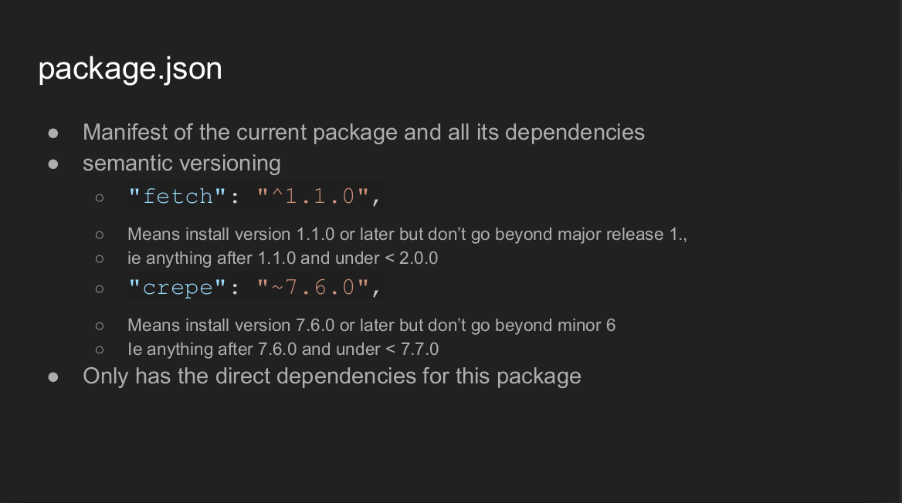
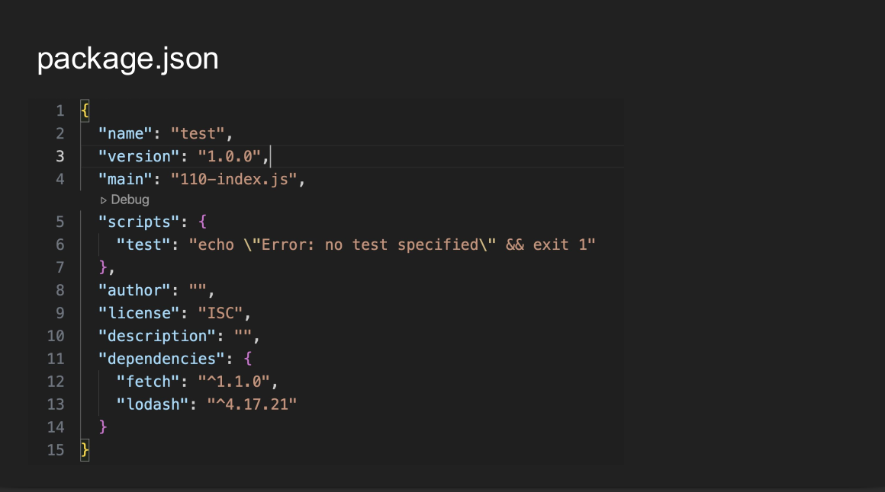
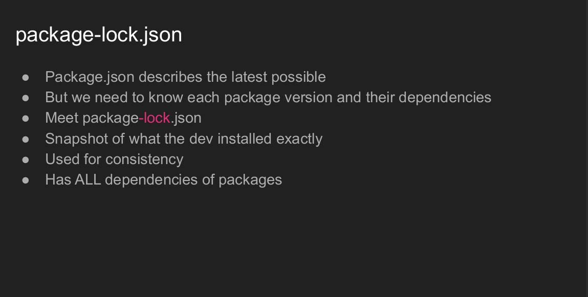
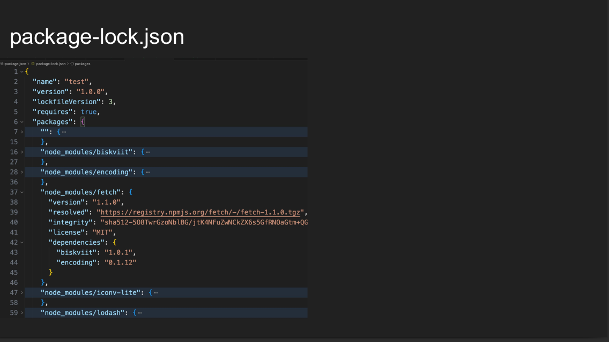
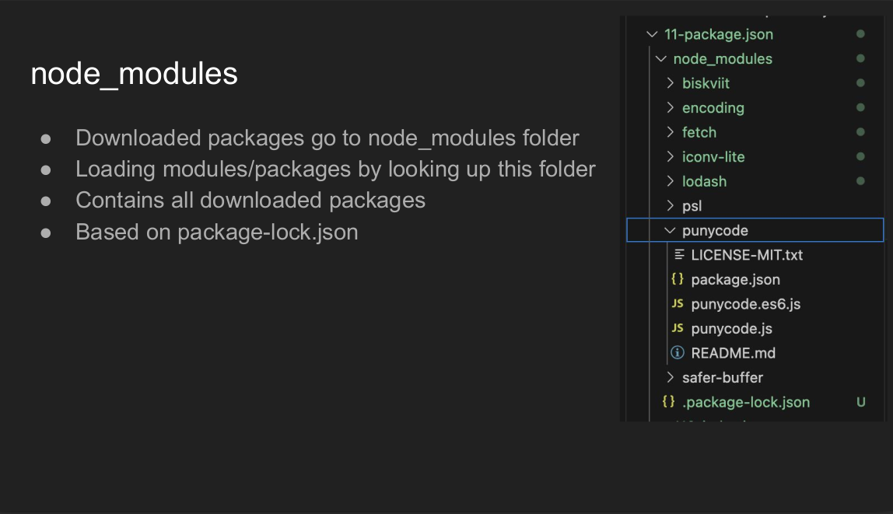
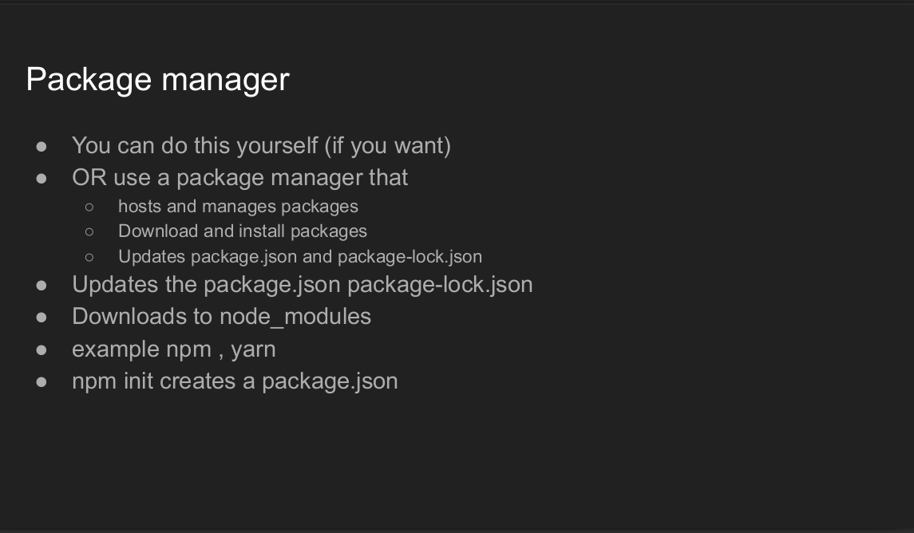
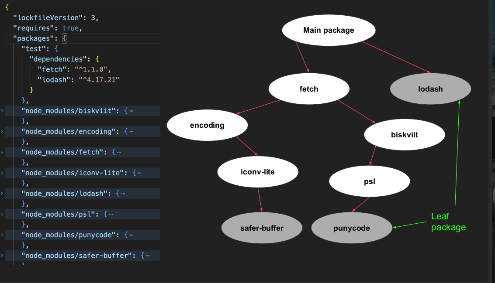
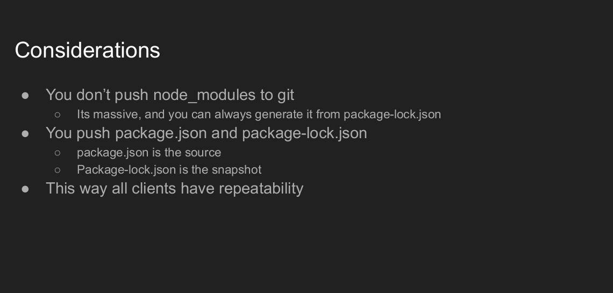

# What is Package

# Package-lock

# Package Manager

# Consideration

# 📦 Node.js Project Setup Guide

---

## 📚 Table of Contents

- [1. `package.json`](#1-packagejson)
- [2. `package-lock.json`](#2-package-lockjson)
- [3. `node_modules/`](#3-node_modules)
- [4. Commands: `npm install` vs `npm ci`](#4-commands-npm-install-vs-npm-ci)

---

## 1. `package.json`

- **Manifest file** for your Node.js project.
- **Lists**:
  - Project name, version, description
  - **Dependencies** (libraries your project uses)
  - **Scripts** (like `npm run start`, `npm run build`, etc.)
- **✅ Push `package.json` to Git.**

---

## 2. `package-lock.json`

- **Auto-generated file** when you install npm packages.
- **Locks** exact versions of all dependencies (even nested ones).
- Ensures **everyone installs the exact same dependency versions**.
- **✅ Push `package-lock.json` to Git.**

---

## 3. `node_modules/`

- **Folder** where installed packages live after running `npm install`.
- Can become **very large** (hundreds of MBs).
- **❌ NEVER push `node_modules/` to Git.**
  - Add `node_modules/` to your `.gitignore`.
  - Everyone can rebuild it locally using `npm install`.

---

## 4. Commands: `npm install` vs `npm ci`

| Command       | Purpose                                    | Behavior                                                                                                                    |
| ------------- | ------------------------------------------ | --------------------------------------------------------------------------------------------------------------------------- |
| `npm install` | Install dependencies                       | Syncs with `package.json` and `package-lock.json`, may update lock file                                                     |
| `npm ci`      | Install for CI/CD (Continuous Integration) | Only uses `package-lock.json`, never updates it, faster and cleaner, throw error if file `package-lock.json` does not exist |
