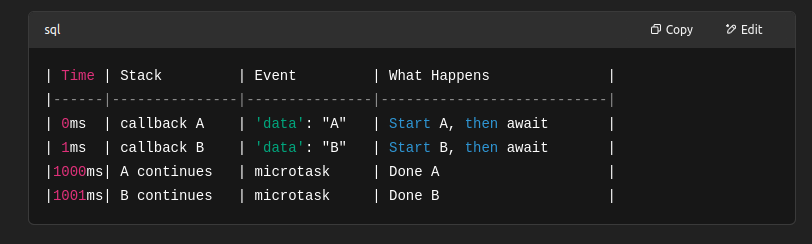

# 🔧 How Socket Events Work in Node.js

- Uses libuv (C library) to wrap OS system calls like epoll, kqueue, or IOCP depending on the OS.
- Registers the socket file descriptor (FD) with the OS event poller.
- When the socket becomes readable or writable, the OS notifies libuv.
- libuv pushes a callback into the Node.js Event Loop queue.
- Node.js processes that callback in one of the event loop phases.

🔁 Then it loops again. Socket readiness is usually caught in the poll phase, and callbacks like socket.on('data') are executed. <br>

## const net = require('net');

```js
const server = net.createServer((socket) => {
  console.log("Client connected");

  socket.on("data", (data) => {
    console.log("Received:", data.toString());
    socket.write("Echo: " + data);
  });

  socket.on("end", () => {
    console.log("Client disconnected");
  });
});

server.listen(8000, () => {
  console.log("Server listening on port 8000");
});
```

### 🧬 Internally, what happens:

- net.createServer calls libuv to open a TCP socket.
- When socket.on('data') is set, libuv monitors the FD for readability.
- A client sends data → OS signals FD ready via epoll/kqueue/IOCP.
- libuv pushes the 'data' callback into the poll phase queue.
- Event loop hits poll phase → executes socket.on('data').


# Socket event with Await keyword

## 🔁 Problem Recap

```js
socket.on("data", async (data) => {
  await processMessage(data);
});
```

At first glance, it looks like: <br>

- You wait for processMessage(data) to finish
- Then you're done

BUT… <br>

- If the socket receives multiple messages quickly, this callback can start multiple times in parallel. That’s because Node doesn't wait for your await to finish before running the next 'data' event handler.

## 🔥 Example Showing the Problem

```js
const net = require("net");

const server = net.createServer((socket) => {
  socket.on("data", async (data) => {
    console.log(`Received: ${data}`);
    await new Promise((resolve) => setTimeout(resolve, 1000)); // simulating a slow task
    console.log(`Processed: ${data}`);
  });
});

server.listen(8000);
```

## What happens if the client sends data fast?

```js
Client sends: A
Client sends: B

```

Expected output: <br>

```js
Received: A
(wait 1 sec)
Processed: A
Received: B
(wait 1 sec)
Processed: B

```

But you’ll likely get: <br>

```js
Received: A;
Received: B;
Processed: A;
Processed: B;
```

😬 Uh-oh — both events ran in parallel. <br>

## 🧠 Why this happens?

```js
socket.on('data', async (data) => { ... });

```

- Registers a callback
- The OS notifies libuv that data is ready
- libuv queues a 'data' event into the event loop
- When the loop reaches the 'poll' phase, it fires your callback
- It doesn't care that it's async — it just calls it and moves on

So: <br>

- Each time 'data' fires, it runs that callback, even if the previous one is still waiting!

## ✅ Solution: Serialize the Data Processing

- You need to queue messages, and process them one at a time, like this:

## ✅ Good Code With Line-by-Line Comments

```js
const net = require("net");

const server = net.createServer((socket) => {
  const queue = []; // 1. holds incoming data chunks
  let busy = false; // 2. flag to know if we're already processing

  socket.on("data", (data) => {
    queue.push(data); // 3. add each incoming message to the queue
    processQueue(); // 4. try to process the queue
  });

  async function processQueue() {
    if (busy) return; // 5. prevent running multiple times
    busy = true;

    while (queue.length > 0) {
      const chunk = queue.shift(); // 6. take the first message
      console.log("Received:", chunk.toString());

      await new Promise((resolve) => setTimeout(resolve, 1000)); // 7. simulate async delay

      console.log("Processed:", chunk.toString()); // 8. log after "processing"
    }

    busy = false; // 9. done processing all current messages
  }
});

server.listen(8000, () => console.log("Server listening on port 8000"));
```

- await doesn't block the next 'data' event.
- Each event spawns its own async function.
- If you need order + one-at-a-time, you must queue data manually.
- The queue processes one item only after await completes the previous one.

## Another Example - 🧠 What really happens when await is used in event-based code

```js
socket.on("data", async (data) => {
  console.log("Start:", data.toString());
  await someAsyncTask(); // ← yields!
  console.log("Done:", data.toString());
});
```

### Imagine 2 messages come quickly: "A" then "B"

### ⏱ 0ms <br>

- "A" arrives
- JS enters socket callback:

```js
console.log("Start: A");
await someAsyncTask(); // yields to event loop!
```

- JS pauses this function and schedules continuation for later
- Now event loop is free again

### ⏱ 1ms <br>

- "B" arrives
- Event loop is idle, so another socket.on('data') runs

```js
console.log("Start: B");
await someAsyncTask(); // yields again
```

Now two paused async callbacks are waiting for their promises to resolve <br>

### ⏱ 1000ms <br>

Promise from "A" resolves → Continuation resumes: <br>

```js
console.log("Done: A");
```

### ⏱ 1001ms

```js
console.log("Done: B");
```

😱 Why this surprises people <br>

- The event loop checks if the call stack is empty, yes — but it doesn’t check if you’re in the middle of an await!

- Each await gives control back to the event loop, so another event can run, even if the previous one didn’t finish its full logic yet.

- So it looks like “parallel” execution, but it's actually interleaving — not truly parallel.



## 🧠 1. What happens when you use await?

```js
await someAsyncTask();
```

- It does not block the thread. Instead:
- JS runs the part before the await
- It calls someAsyncTask() and gets a Promise
- JS exits the current function (pauses it)
- JS remembers where to continue (this is called a continuation)
- When the Promise resolves, Node schedules the rest of the function to run later

This is the key: **JS splits your function into two parts — before await and after it**. <br>

## 🔄 2. So… where does the continuation go?

- Great question — it enters the microtask queue (aka next tick queue in Node.js, or Promise jobs queue in JS engines).

- But the exact time it runs depends on event loop phases.

🧠 Important rule: <br>

- After every phase (especially after timers, poll, etc), Node drains microtasks — e.g., your await continuation.

## 💡 Where does socket data + await go?

```js
socket.on("data", async (data) => {
  console.log("Start:", data.toString());

  await someAsyncTask(); // ← pause here

  console.log("Done:", data.toString()); // ← microtask continuation
});
```

### Suppose 2 chunks of data arrive quickly:

```
Step-by-step Timeline:

1. Poll phase:
   - socket receives 'data' => callback runs
   - prints "Start A"
   - hits `await` → exits to event loop
   - schedules continuation to microtask queue

2. Poll phase (still open):
   - socket receives another 'data' => callback runs
   - prints "Start B"
   - hits `await` → schedules continuation too

3. Microtasks:
   - After poll, Node processes:
     → "Done A"
     → "Done B"

```

- await splits your function into before/after parts.
- The "after" part is put into the microtask queue.
- Node has 6 event loop phases, and it drains microtasks between phases.
- Your socket events fire in the poll phase.
- await doesn’t block other 'data' events — they’re async functions and can overlap.
- Fix that with a queue to process one at a time.
